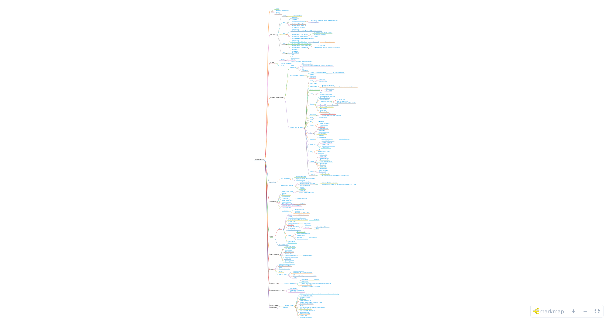

# Navigation




[navigation.md](navigation.md)




#### Table of contents

* [Home](https://bryan-guner.gitbook.io/datastructures-in-pytho/README)
* [Downloads & Misc-Assets](https://bryan-guner.gitbook.io/datastructures-in-pytho/index)
* [README](https://bryan-guner.gitbook.io/datastructures-in-pytho/readme-1)
* [Navigation](https://bryan-guner.gitbook.io/datastructures-in-pytho/navigation)

#### Curriculum

* [Outline](https://bryan-guner.gitbook.io/datastructures-in-pytho/curriculum/untitled/README)
  * [General Content](https://bryan-guner.gitbook.io/datastructures-in-pytho/curriculum/untitled/general-content)
* [wk17](https://bryan-guner.gitbook.io/datastructures-in-pytho/curriculum/untitled-3/README)
  * [Outline-w17](https://bryan-guner.gitbook.io/datastructures-in-pytho/curriculum/untitled-3/outline)
  * [homework](https://bryan-guner.gitbook.io/datastructures-in-pytho/curriculum/untitled-3/week-overview)
  * [D1-Module 01 - Python I](https://bryan-guner.gitbook.io/datastructures-in-pytho/curriculum/untitled-3/untitled-2/README)
    * [Configuring Ubuntu for Python Web Development](https://bryan-guner.gitbook.io/datastructures-in-pytho/curriculum/untitled-3/untitled-2/configuring-ubuntu-for-python-web-development)
    * [Install Python](https://bryan-guner.gitbook.io/datastructures-in-pytho/curriculum/untitled-3/untitled-2/install-python)
  * [D2- Module 02 - Python II](https://bryan-guner.gitbook.io/datastructures-in-pytho/curriculum/untitled-3/untitled-1-1)
  * [D3- Module 03 - Python III](https://bryan-guner.gitbook.io/datastructures-in-pytho/curriculum/untitled-3/untitled-1)
  * [D4-Module 04 - Python IV](https://bryan-guner.gitbook.io/datastructures-in-pytho/curriculum/untitled-3/untitled)
* [wk18](https://bryan-guner.gitbook.io/datastructures-in-pytho/curriculum/untitled-2/README)
  * [Outline-W-18](https://bryan-guner.gitbook.io/datastructures-in-pytho/curriculum/untitled-2/untitled-4)
  * [D1- Module 01 - Number Bases and Character Encoding](https://bryan-guner.gitbook.io/datastructures-in-pytho/curriculum/untitled-2/untitled-3)
  * [D2- Module 02 - Hash Tables I](https://bryan-guner.gitbook.io/datastructures-in-pytho/curriculum/untitled-2/untitled-2/README)
    * [Hash Table / Hash Map In Python:](https://bryan-guner.gitbook.io/datastructures-in-pytho/curriculum/untitled-2/untitled-2/hash-table-hash-map-in-python)
    * [Hash Table Use Cases](https://bryan-guner.gitbook.io/datastructures-in-pytho/curriculum/untitled-2/untitled-2/hash-table-use-cases)
    * [Practice](https://bryan-guner.gitbook.io/datastructures-in-pytho/curriculum/untitled-2/untitled-2/practice)
  * [D3-Module 03 - Hash Tables II](https://bryan-guner.gitbook.io/datastructures-in-pytho/curriculum/untitled-2/untitled-1)
  * [D4- Module 04 - Searching and Recursion](https://bryan-guner.gitbook.io/datastructures-in-pytho/curriculum/untitled-2/untitled)
* [wk19](https://bryan-guner.gitbook.io/datastructures-in-pytho/curriculum/untitled-4/README)
  * [Outline-W-19](https://bryan-guner.gitbook.io/datastructures-in-pytho/curriculum/untitled-4/overview)
  * [D1- Module 01 - Linked Lists](https://bryan-guner.gitbook.io/datastructures-in-pytho/curriculum/untitled-4/untitled-3/README)
    * [Homework](https://bryan-guner.gitbook.io/datastructures-in-pytho/curriculum/untitled-4/untitled-3/homework/README)
      * [Helpful Resource](https://bryan-guner.gitbook.io/datastructures-in-pytho/curriculum/untitled-4/untitled-3/homework/helpful-resource)
  * [D2- Module 02 - Queues and Stacks](https://bryan-guner.gitbook.io/datastructures-in-pytho/curriculum/untitled-4/untitled-7)
  * [D3- Module 03 - Binary Search Trees](https://bryan-guner.gitbook.io/datastructures-in-pytho/curriculum/untitled-4/untitled-8/README)
    * [BST Definition:](https://bryan-guner.gitbook.io/datastructures-in-pytho/curriculum/untitled-4/untitled-8/bst-definition)
  * [D4- Module 04 - Tree Traversal](https://bryan-guner.gitbook.io/datastructures-in-pytho/curriculum/untitled-4/untitled-5/README)
    * [Tree Traversals (Inorder, Preorder and Postorder)](https://bryan-guner.gitbook.io/datastructures-in-pytho/curriculum/untitled-4/untitled-5/tree-traversals-inorder-preorder-and-postorder)
* [wk20](https://bryan-guner.gitbook.io/datastructures-in-pytho/curriculum/untitled-1/README)
  * [Outline-W-20](https://bryan-guner.gitbook.io/datastructures-in-pytho/curriculum/untitled-1/overview)
  * [D1-Graphs I](https://bryan-guner.gitbook.io/datastructures-in-pytho/curriculum/untitled-1/untitled-5)
  * [D2-Graphs 2](https://bryan-guner.gitbook.io/datastructures-in-pytho/curriculum/untitled-1/untitled-4)
  * [DFS](https://bryan-guner.gitbook.io/datastructures-in-pytho/curriculum/untitled-1/untitled-1)
  * [D4](https://bryan-guner.gitbook.io/datastructures-in-pytho/curriculum/untitled-1/untitled-2)

#### Utilities

* [Utilites](https://bryan-guner.gitbook.io/datastructures-in-pytho/utilities/untitled/README)
  * [Python Libraries](https://bryan-guner.gitbook.io/datastructures-in-pytho/utilities/untitled/python-libraries)
  * [YouTube](https://bryan-guner.gitbook.io/datastructures-in-pytho/utilities/untitled/untitled)
  * [Code Lab Notebook Embeds From Lecture](https://bryan-guner.gitbook.io/datastructures-in-pytho/utilities/untitled/code-lab-notebook-embeds-from-lecture)
* [Code lab Notebooks](https://bryan-guner.gitbook.io/datastructures-in-pytho/utilities/code-lab-notebooks)
* [Repl.IT](https://bryan-guner.gitbook.io/datastructures-in-pytho/utilities/repl.it/README)
  * [Trinket](https://bryan-guner.gitbook.io/datastructures-in-pytho/utilities/repl.it/trinket)

#### Abstract Data Structures

* [Algorithms](https://bryan-guner.gitbook.io/datastructures-in-pytho/abstract-data-structures/algorithms-1/README)
  * [Dijkstra's algorithm](https://bryan-guner.gitbook.io/datastructures-in-pytho/abstract-data-structures/algorithms-1/dijkstras-algorithm)
  * [Calculate a Factorial With Python - Iterative and Recursive](https://bryan-guner.gitbook.io/datastructures-in-pytho/abstract-data-structures/algorithms-1/calculate-a-factorial-with-python-iterative-and-recursive)
  * [DFS](https://bryan-guner.gitbook.io/datastructures-in-pytho/abstract-data-structures/algorithms-1/dfs)
  * [BFS](https://bryan-guner.gitbook.io/datastructures-in-pytho/abstract-data-structures/algorithms-1/bfs)
  * [Palendrome](https://bryan-guner.gitbook.io/datastructures-in-pytho/abstract-data-structures/algorithms-1/palendrome)
* [Data Structures Overview](https://bryan-guner.gitbook.io/datastructures-in-pytho/abstract-data-structures/untitled-7/README)
  * [General Data Structures Notes](https://bryan-guner.gitbook.io/datastructures-in-pytho/abstract-data-structures/untitled-7/general-data-structures-notes/README)
    * [DS-Explained-Simple](https://bryan-guner.gitbook.io/datastructures-in-pytho/abstract-data-structures/untitled-7/general-data-structures-notes/ds-explained-simple)
  * [Untitled](https://bryan-guner.gitbook.io/datastructures-in-pytho/abstract-data-structures/untitled-7/untitled)
  * [Algorithms](https://bryan-guner.gitbook.io/datastructures-in-pytho/abstract-data-structures/untitled-7/algorithms)
  * [Dictionary](https://bryan-guner.gitbook.io/datastructures-in-pytho/abstract-data-structures/untitled-7/dictionary)
* [Abstract Data Structures:](https://bryan-guner.gitbook.io/datastructures-in-pytho/abstract-data-structures/untitled-1/README)
  * [Array](https://bryan-guner.gitbook.io/datastructures-in-pytho/abstract-data-structures/untitled-1/array/README)
    * [Extra-Array](https://bryan-guner.gitbook.io/datastructures-in-pytho/abstract-data-structures/untitled-1/array/extra-array)
    * [Array Practice](https://bryan-guner.gitbook.io/datastructures-in-pytho/abstract-data-structures/untitled-1/array/array-practice)
  * [Binary Search](https://bryan-guner.gitbook.io/datastructures-in-pytho/abstract-data-structures/untitled-1/binary-search)
  * [Binary Tree](https://bryan-guner.gitbook.io/datastructures-in-pytho/abstract-data-structures/untitled-1/binary-tree/README)
    * [Binary Tree Explained](https://bryan-guner.gitbook.io/datastructures-in-pytho/abstract-data-structures/untitled-1/binary-tree/binary-tree-explained)
    * [Find the maximum path sum between two leaves of a binary tree](https://bryan-guner.gitbook.io/datastructures-in-pytho/abstract-data-structures/untitled-1/binary-tree/find-the-maximum-path-sum-between-two-leaves-of-a-binary-tree)
  * [Binary Search Tree](https://bryan-guner.gitbook.io/datastructures-in-pytho/abstract-data-structures/untitled-1/binary-search-tree/README)
    * [BST Explained](https://bryan-guner.gitbook.io/datastructures-in-pytho/abstract-data-structures/untitled-1/binary-search-tree/bst-explained)
    * [BST Insert](https://bryan-guner.gitbook.io/datastructures-in-pytho/abstract-data-structures/untitled-1/binary-search-tree/bst-insert)
  * [Exotic](https://bryan-guner.gitbook.io/datastructures-in-pytho/abstract-data-structures/untitled-1/untitled/README)
    * [Tire](https://bryan-guner.gitbook.io/datastructures-in-pytho/abstract-data-structures/untitled-1/untitled/tire)
    * [Dynamic Programming](https://bryan-guner.gitbook.io/datastructures-in-pytho/abstract-data-structures/untitled-1/untitled/dynamic-programming)
  * [Graphs](https://bryan-guner.gitbook.io/datastructures-in-pytho/abstract-data-structures/untitled-1/untitled-1/README)
    * [Overflow Practice Problems](https://bryan-guner.gitbook.io/datastructures-in-pytho/abstract-data-structures/untitled-1/untitled-1/overflow-practice-problems)
    * [Graphs Explained](https://bryan-guner.gitbook.io/datastructures-in-pytho/abstract-data-structures/untitled-1/untitled-1/graphs-explained)
    * [Earliest Ancestor](https://bryan-guner.gitbook.io/datastructures-in-pytho/abstract-data-structures/untitled-1/untitled-1/earliest-ancestor)
    * [\_Mini Graph-Projects](https://bryan-guner.gitbook.io/datastructures-in-pytho/abstract-data-structures/untitled-1/untitled-1/\_mini-graph-projects/README)
      * [# Social Graph](https://bryan-guner.gitbook.io/datastructures-in-pytho/abstract-data-structures/untitled-1/untitled-1/\_mini-graph-projects/social-graph)
      * [number of 1 islands](https://bryan-guner.gitbook.io/datastructures-in-pytho/abstract-data-structures/untitled-1/untitled-1/\_mini-graph-projects/number-of-1-islands)
      * [Searching and Generating Graphs](https://bryan-guner.gitbook.io/datastructures-in-pytho/abstract-data-structures/untitled-1/untitled-1/\_mini-graph-projects/searching-and-generating-graphs)
    * [Graph FAQ](https://bryan-guner.gitbook.io/datastructures-in-pytho/abstract-data-structures/untitled-1/untitled-1/graph-faq/README)
      * [Graph DFS](https://bryan-guner.gitbook.io/datastructures-in-pytho/abstract-data-structures/untitled-1/untitled-1/graph-faq/graph-dfs)
    * [Connected Components](https://bryan-guner.gitbook.io/datastructures-in-pytho/abstract-data-structures/untitled-1/untitled-1/connected-components)
    * [Randomness](https://bryan-guner.gitbook.io/datastructures-in-pytho/abstract-data-structures/untitled-1/untitled-1/untitled)
    * [Graph BFS](https://bryan-guner.gitbook.io/datastructures-in-pytho/abstract-data-structures/untitled-1/untitled-1/graph-bfs)
    * [Topological Sort](https://bryan-guner.gitbook.io/datastructures-in-pytho/abstract-data-structures/untitled-1/untitled-1/topological-sort)
  * [Hash Table](https://bryan-guner.gitbook.io/datastructures-in-pytho/abstract-data-structures/untitled-1/untitled-5/README)
    * [Hashmap or Hash tables](https://bryan-guner.gitbook.io/datastructures-in-pytho/abstract-data-structures/untitled-1/untitled-5/hashmap-or-hash-tables)
    * [Hash Table and HashMap in Python](https://bryan-guner.gitbook.io/datastructures-in-pytho/abstract-data-structures/untitled-1/untitled-5/hash-table-and-hashmap-in-python)
  * [Heap](https://bryan-guner.gitbook.io/datastructures-in-pytho/abstract-data-structures/untitled-1/heap/README)
    * [Heap Examples](https://bryan-guner.gitbook.io/datastructures-in-pytho/abstract-data-structures/untitled-1/heap/heap-examples)
  * [String](https://bryan-guner.gitbook.io/datastructures-in-pytho/abstract-data-structures/untitled-1/string)
  * [Map](https://bryan-guner.gitbook.io/datastructures-in-pytho/abstract-data-structures/untitled-1/map/README)
    * [Examples](https://bryan-guner.gitbook.io/datastructures-in-pytho/abstract-data-structures/untitled-1/map/examples)
  * [Queue](https://bryan-guner.gitbook.io/datastructures-in-pytho/abstract-data-structures/untitled-1/queue/README)
    * [Queue Continued...](https://bryan-guner.gitbook.io/datastructures-in-pytho/abstract-data-structures/untitled-1/queue/queue-continued...)
    * [Queue Sandbox](https://bryan-guner.gitbook.io/datastructures-in-pytho/abstract-data-structures/untitled-1/queue/queue-sandbox)
    * [Dequeue](https://bryan-guner.gitbook.io/datastructures-in-pytho/abstract-data-structures/untitled-1/queue/dequeue)
  * [Tree](https://bryan-guner.gitbook.io/datastructures-in-pytho/abstract-data-structures/untitled-1/tree/README)
    * [In Order Traversal](https://bryan-guner.gitbook.io/datastructures-in-pytho/abstract-data-structures/untitled-1/tree/in-order-traversal)
    * [Tree Equal ?](https://bryan-guner.gitbook.io/datastructures-in-pytho/abstract-data-structures/untitled-1/tree/tree-equal)
    * [Ternary-search-trees](https://bryan-guner.gitbook.io/datastructures-in-pytho/abstract-data-structures/untitled-1/tree/ternary-search-trees)
    * [Red\_Black Tree](https://bryan-guner.gitbook.io/datastructures-in-pytho/abstract-data-structures/untitled-1/tree/red\_black-tree)
    * [Tree Mirror:](https://bryan-guner.gitbook.io/datastructures-in-pytho/abstract-data-structures/untitled-1/tree/tree-mirror)
    * [Tree Traversal](https://bryan-guner.gitbook.io/datastructures-in-pytho/abstract-data-structures/untitled-1/tree/tree-traversal)
  * [Recursion](https://bryan-guner.gitbook.io/datastructures-in-pytho/abstract-data-structures/untitled-1/untitled-6/README)
    * [Recursion Explained](https://bryan-guner.gitbook.io/datastructures-in-pytho/abstract-data-structures/untitled-1/untitled-6/recursion-explained/README)
      * [Recursion Examples](https://bryan-guner.gitbook.io/datastructures-in-pytho/abstract-data-structures/untitled-1/untitled-6/recursion-explained/recursion-examples)
  * [Linked List](https://bryan-guner.gitbook.io/datastructures-in-pytho/abstract-data-structures/untitled-1/untitled-4/README)
    * [Linked List Background](https://bryan-guner.gitbook.io/datastructures-in-pytho/abstract-data-structures/untitled-1/untitled-4/untitled)
    * [Double Linked List](https://bryan-guner.gitbook.io/datastructures-in-pytho/abstract-data-structures/untitled-1/untitled-4/double-linked-list)
    * [List Example](https://bryan-guner.gitbook.io/datastructures-in-pytho/abstract-data-structures/untitled-1/untitled-4/list-example)
    * [Examples (LL) continued](https://bryan-guner.gitbook.io/datastructures-in-pytho/abstract-data-structures/untitled-1/untitled-4/examples-ll-continued)
    * [List Operations](https://bryan-guner.gitbook.io/datastructures-in-pytho/abstract-data-structures/untitled-1/untitled-4/list-operations)
  * [Set](https://bryan-guner.gitbook.io/datastructures-in-pytho/abstract-data-structures/untitled-1/set/README)
    * [Set](https://bryan-guner.gitbook.io/datastructures-in-pytho/abstract-data-structures/untitled-1/set/set)
    * [Set Intersection Union](https://bryan-guner.gitbook.io/datastructures-in-pytho/abstract-data-structures/untitled-1/set/set-intersection-union)
    * [Disjoint Set](https://bryan-guner.gitbook.io/datastructures-in-pytho/abstract-data-structures/untitled-1/set/disjoint-set)
  * [Sorting](https://bryan-guner.gitbook.io/datastructures-in-pytho/abstract-data-structures/untitled-1/untitled-3/README)
    * [In JavaScript](https://bryan-guner.gitbook.io/datastructures-in-pytho/abstract-data-structures/untitled-1/untitled-3/in-javascript)
    * [Merge Sort](https://bryan-guner.gitbook.io/datastructures-in-pytho/abstract-data-structures/untitled-1/untitled-3/merge-sort-1)
    * [Iterative Sorting](https://bryan-guner.gitbook.io/datastructures-in-pytho/abstract-data-structures/untitled-1/untitled-3/iterative-sorting)
    * [Recursive Sorting](https://bryan-guner.gitbook.io/datastructures-in-pytho/abstract-data-structures/untitled-1/untitled-3/recursive-sorting)
    * [Graph Topological Sort](https://bryan-guner.gitbook.io/datastructures-in-pytho/abstract-data-structures/untitled-1/untitled-3/graph-topological-sort)
    * [SelectionSort](https://bryan-guner.gitbook.io/datastructures-in-pytho/abstract-data-structures/untitled-1/untitled-3/selectionsort)
    * [Quick Sort](https://bryan-guner.gitbook.io/datastructures-in-pytho/abstract-data-structures/untitled-1/untitled-3/untitled-7)
    * [Merge Sort](https://bryan-guner.gitbook.io/datastructures-in-pytho/abstract-data-structures/untitled-1/untitled-3/merge-sort)
    * [Insertion Sort](https://bryan-guner.gitbook.io/datastructures-in-pytho/abstract-data-structures/untitled-1/untitled-3/insertion-sort)
  * [Stack](https://bryan-guner.gitbook.io/datastructures-in-pytho/abstract-data-structures/untitled-1/stack/README)
    * [Stack Continued](https://bryan-guner.gitbook.io/datastructures-in-pytho/abstract-data-structures/untitled-1/stack/stack-continued)
    * [Stack Part 3](https://bryan-guner.gitbook.io/datastructures-in-pytho/abstract-data-structures/untitled-1/stack/stack-part-3)
  * [Searching](https://bryan-guner.gitbook.io/datastructures-in-pytho/abstract-data-structures/untitled-1/untitled-2/README)
    * [Binary Search](https://bryan-guner.gitbook.io/datastructures-in-pytho/abstract-data-structures/untitled-1/untitled-2/binary-search)
    * [Searching & Sorting Computational Complexity (JS)](https://bryan-guner.gitbook.io/datastructures-in-pytho/abstract-data-structures/untitled-1/untitled-2/searching-and-sorting-computational-complexity-js)

#### practice

* [GCA Sprint Prep:](https://bryan-guner.gitbook.io/datastructures-in-pytho/practice/gca-sprint-prep/README)
  * [Practice Problems](https://bryan-guner.gitbook.io/datastructures-in-pytho/practice/gca-sprint-prep/practice-problems)
  * [Code Signal CGA Sprint Resources](https://bryan-guner.gitbook.io/datastructures-in-pytho/practice/gca-sprint-prep/code-signal-cga-sprint-resources)
  * [CGA-Sprint Prep](https://bryan-guner.gitbook.io/datastructures-in-pytho/practice/gca-sprint-prep/cga-sprint-prep)
* [Supplemental Practice:](https://bryan-guner.gitbook.io/datastructures-in-pytho/practice/supplemental-practice/README)
  * [JavaScript Algorithms](https://bryan-guner.gitbook.io/datastructures-in-pytho/practice/supplemental-practice/javascript-algorithms)
  * [Industry Standard Algorithms](https://bryan-guner.gitbook.io/datastructures-in-pytho/practice/supplemental-practice/industry-standard-algorithms/README)
    * [Interview Practice Resources](https://bryan-guner.gitbook.io/datastructures-in-pytho/practice/supplemental-practice/industry-standard-algorithms/interview-practice-resources)
    * [Write a Program to Find the Maximum Depth or Height of a Tree](https://bryan-guner.gitbook.io/datastructures-in-pytho/practice/supplemental-practice/industry-standard-algorithms/write-a-program-to-find-the-maximum-depth-or-height-of-a-tree)
  * [Random Examples](https://bryan-guner.gitbook.io/datastructures-in-pytho/practice/supplemental-practice/random-examples)
  * [Prompts](https://bryan-guner.gitbook.io/datastructures-in-pytho/practice/supplemental-practice/prompts)
  * [JS\_BASICS](https://bryan-guner.gitbook.io/datastructures-in-pytho/practice/supplemental-practice/js\_basics)

#### Resources

* [Python Cheat Sheet](https://bryan-guner.gitbook.io/datastructures-in-pytho/resources/python-cheat-sheet/README)
  * [Cheatsheet-v2](https://bryan-guner.gitbook.io/datastructures-in-pytho/resources/python-cheat-sheet/cheatsheet-v2)
  * [List Of Python Cheat Sheets](https://bryan-guner.gitbook.io/datastructures-in-pytho/resources/python-cheat-sheet/bash-commands)
* [Youtube](https://bryan-guner.gitbook.io/datastructures-in-pytho/resources/youtube)
* [PDF Downloads](https://bryan-guner.gitbook.io/datastructures-in-pytho/resources/pdf-downloads)
* [Intro 2 Python](https://bryan-guner.gitbook.io/datastructures-in-pytho/resources/intro-2-python)
* [Dictionaries](https://bryan-guner.gitbook.io/datastructures-in-pytho/resources/dictionaries/README)
  * [Dictionaries Continued](https://bryan-guner.gitbook.io/datastructures-in-pytho/resources/dictionaries/dictionaries-continued)
* [Python VS JavaScript](https://bryan-guner.gitbook.io/datastructures-in-pytho/resources/python-vs-javascript)
* [Misc. Resources](https://bryan-guner.gitbook.io/datastructures-in-pytho/resources/untitled-1)
* [Things To Internalize:](https://bryan-guner.gitbook.io/datastructures-in-pytho/resources/things-to-internalize/README)
  * [Functions](https://bryan-guner.gitbook.io/datastructures-in-pytho/resources/things-to-internalize/functions)
* [Intro To Python w Jupyter Notebooks](https://bryan-guner.gitbook.io/datastructures-in-pytho/resources/intro-to-python-w-jupyter-notebooks)
* [Calculating Big O](https://bryan-guner.gitbook.io/datastructures-in-pytho/resources/calculating-big-o)
* [Useful Links](https://bryan-guner.gitbook.io/datastructures-in-pytho/resources/untitled/README)
  * [Awesome Python](https://bryan-guner.gitbook.io/datastructures-in-pytho/resources/untitled/awesome-python)
  * [My-Links](https://bryan-guner.gitbook.io/datastructures-in-pytho/resources/untitled/my-links)
  * [Beginners Guide To Python](https://bryan-guner.gitbook.io/datastructures-in-pytho/resources/untitled/beginners-guide-to-python)

#### Docs 

* [Docs](https://bryan-guner.gitbook.io/datastructures-in-pytho/stdlib/untitled/README)
  * [Strings](https://bryan-guner.gitbook.io/datastructures-in-pytho/stdlib/untitled/strings/README)
    * [Strings Continued](https://bryan-guner.gitbook.io/datastructures-in-pytho/stdlib/untitled/strings/strings-continued)
  * [Touple](https://bryan-guner.gitbook.io/datastructures-in-pytho/stdlib/untitled/touple)
  * [Values Expressions & Statments](https://bryan-guner.gitbook.io/datastructures-in-pytho/stdlib/untitled/values-expressions-and-statments)
  * [Dictionaries, sets, files, and modules](https://bryan-guner.gitbook.io/datastructures-in-pytho/stdlib/untitled/dictionaries-sets-files-and-modules/README)
    * [Modules](https://bryan-guner.gitbook.io/datastructures-in-pytho/stdlib/untitled/dictionaries-sets-files-and-modules/modules)
  * [Built-in Types](https://bryan-guner.gitbook.io/datastructures-in-pytho/stdlib/untitled/untitled-2)
  * [Built In Functions](https://bryan-guner.gitbook.io/datastructures-in-pytho/stdlib/untitled/built-in-functions/README)
    * [Zip Function](https://bryan-guner.gitbook.io/datastructures-in-pytho/stdlib/untitled/built-in-functions/zip-function)
  * [Functions](https://bryan-guner.gitbook.io/datastructures-in-pytho/stdlib/untitled/untitled-1)
  * [Classes and objects](https://bryan-guner.gitbook.io/datastructures-in-pytho/stdlib/untitled/classes-and-objects/README)
    * [Inheritance](https://bryan-guner.gitbook.io/datastructures-in-pytho/stdlib/untitled/classes-and-objects/untitled-2)
    * [Classes](https://bryan-guner.gitbook.io/datastructures-in-pytho/stdlib/untitled/classes-and-objects/classes/README)
      * [Python Objects & Classes](https://bryan-guner.gitbook.io/datastructures-in-pytho/stdlib/untitled/classes-and-objects/classes/python-objects-and-classes)
      * [index](https://bryan-guner.gitbook.io/datastructures-in-pytho/stdlib/untitled/classes-and-objects/classes/untitled)
  * [Dictionaries](https://bryan-guner.gitbook.io/datastructures-in-pytho/stdlib/untitled/dictionaries)
  * [Conditionals and loops](https://bryan-guner.gitbook.io/datastructures-in-pytho/stdlib/untitled/conditionals-and-loops)
  * [Lists](https://bryan-guner.gitbook.io/datastructures-in-pytho/stdlib/untitled/lists/README)
    * [Reverse A List](https://bryan-guner.gitbook.io/datastructures-in-pytho/stdlib/untitled/lists/reverse-a-list)
    * [Python Data Structures](https://bryan-guner.gitbook.io/datastructures-in-pytho/stdlib/untitled/lists/python-data-structures)
    * [More On Lists](https://bryan-guner.gitbook.io/datastructures-in-pytho/stdlib/untitled/lists/more-on-lists)
    * [Examples](https://bryan-guner.gitbook.io/datastructures-in-pytho/stdlib/untitled/lists/examples/README)
      * [More-Examples](https://bryan-guner.gitbook.io/datastructures-in-pytho/stdlib/untitled/lists/examples/more-examples)
    * [List Compehensions](https://bryan-guner.gitbook.io/datastructures-in-pytho/stdlib/untitled/lists/list-compehensions)
  * [Basic Syntax](https://bryan-guner.gitbook.io/datastructures-in-pytho/stdlib/untitled/basic-syntax)
  * [String-Methods](https://bryan-guner.gitbook.io/datastructures-in-pytho/stdlib/untitled/string-methods)
* [Queue & Stacks](https://bryan-guner.gitbook.io/datastructures-in-pytho/stdlib/queue-and-stacks)

#### quick-reference

* [My Medium Articles](https://bryan-guner.gitbook.io/datastructures-in-pytho/quick-reference/my-medium-articles)
* [Free Python Books](https://bryan-guner.gitbook.io/datastructures-in-pytho/quick-reference/free-python-books)
* [WHY Python?](https://bryan-guner.gitbook.io/datastructures-in-pytho/quick-reference/why-python)
* [Python Snippets](https://bryan-guner.gitbook.io/datastructures-in-pytho/quick-reference/python-snippets)
* [Python3 Regex](https://bryan-guner.gitbook.io/datastructures-in-pytho/quick-reference/python3-regex)
* [Python Module Index:](https://bryan-guner.gitbook.io/datastructures-in-pytho/quick-reference/python-module-index/README)
  * [Requests Module](https://bryan-guner.gitbook.io/datastructures-in-pytho/quick-reference/python-module-index/requests-module)
* [Creating Python Modules](https://bryan-guner.gitbook.io/datastructures-in-pytho/quick-reference/creating-python-modules)
* [Useful Info](https://bryan-guner.gitbook.io/datastructures-in-pytho/quick-reference/untitled)
* [Python Glossary](https://bryan-guner.gitbook.io/datastructures-in-pytho/quick-reference/python-glossary)
* [Python Snippets](https://bryan-guner.gitbook.io/datastructures-in-pytho/quick-reference/untitled-1)

#### MISC

* [Built-in Methods & Functions](https://bryan-guner.gitbook.io/datastructures-in-pytho/misc/built-in-methods-and-functions)
* [Data Structures Types](https://bryan-guner.gitbook.io/datastructures-in-pytho/misc/data-structures-types)
* [Math](https://bryan-guner.gitbook.io/datastructures-in-pytho/misc/math)
* [Unsorted Examples](https://bryan-guner.gitbook.io/datastructures-in-pytho/misc/unsorted-examples)
* [Outline](https://bryan-guner.gitbook.io/datastructures-in-pytho/misc/outline)
* [About Python](https://bryan-guner.gitbook.io/datastructures-in-pytho/misc/untitled/README)
  * [Python VS JavaScript](https://bryan-guner.gitbook.io/datastructures-in-pytho/misc/untitled/python-vs-javascript)
  * [Python Modules & Python Packages](https://bryan-guner.gitbook.io/datastructures-in-pytho/misc/untitled/untitled-1)
  * [Misc](https://bryan-guner.gitbook.io/datastructures-in-pytho/misc/untitled/misc)
  * [Python's Default Argument Values and Lists](https://bryan-guner.gitbook.io/datastructures-in-pytho/misc/untitled/pythons-default-argument-values-and-lists)
  * [SCRAP](https://bryan-guner.gitbook.io/datastructures-in-pytho/misc/untitled/untitled)

#### Interview Prep

* [Interview Resources](https://bryan-guner.gitbook.io/datastructures-in-pytho/interview-prep/interview-resources/README)
  * [By Example](https://bryan-guner.gitbook.io/datastructures-in-pytho/interview-prep/interview-resources/by-example/README)
    * [Algo-Prep](https://bryan-guner.gitbook.io/datastructures-in-pytho/interview-prep/interview-resources/by-example/leetcode)
  * [Permutation](https://bryan-guner.gitbook.io/datastructures-in-pytho/interview-prep/interview-resources/permutation)
  * [How to Write an Effective Resume of Python Developer](https://bryan-guner.gitbook.io/datastructures-in-pytho/interview-prep/interview-resources/how-to-write-an-effective-resume-of-python-developer)
  * [Interview Checklist](https://bryan-guner.gitbook.io/datastructures-in-pytho/interview-prep/interview-resources/interview-checklist)
  * [150 Practice Problems & Solutions](https://bryan-guner.gitbook.io/datastructures-in-pytho/interview-prep/interview-resources/150-practice-problems-and-solutions)

#### Installations Setup & Env

* [python-setup](https://bryan-guner.gitbook.io/datastructures-in-pytho/installations-setup-and-env/untitled)
* [Installing Python Modules](https://bryan-guner.gitbook.io/datastructures-in-pytho/installations-setup-and-env/installing-python-modules)
* [Set Up Virtual Enviornment](https://bryan-guner.gitbook.io/datastructures-in-pytho/installations-setup-and-env/set-up-virtual-enviornment)

#### Aux-Exploration

* [Related Studies](https://bryan-guner.gitbook.io/datastructures-in-pytho/aux-exploration/subject/README)
  * [Self-Organizing Maps: Theory and Implementation in Python with NumPy](https://bryan-guner.gitbook.io/datastructures-in-pytho/aux-exploration/subject/self-organizing-maps-theory-and-implementation-in-python-with-numpy)
  * [List Directory Contents](https://bryan-guner.gitbook.io/datastructures-in-pytho/aux-exploration/subject/list-directory-contents)
  * [Employee Manager](https://bryan-guner.gitbook.io/datastructures-in-pytho/aux-exploration/subject/untitled-5)
  * [OS Module](https://bryan-guner.gitbook.io/datastructures-in-pytho/aux-exploration/subject/untitled-4)
  * [server-side-scripting](https://bryan-guner.gitbook.io/datastructures-in-pytho/aux-exploration/subject/untitled-3)
  * [Reading and Writing to text files in Python](https://bryan-guner.gitbook.io/datastructures-in-pytho/aux-exploration/subject/untitled-2)
  * [General Data Structures](https://bryan-guner.gitbook.io/datastructures-in-pytho/aux-exploration/subject/untitled-1)
  * [Touple](https://bryan-guner.gitbook.io/datastructures-in-pytho/aux-exploration/subject/touple)
  * [How to round Python values to whole numbers?](https://bryan-guner.gitbook.io/datastructures-in-pytho/aux-exploration/subject/untitled)
  * [Python Array Module](https://bryan-guner.gitbook.io/datastructures-in-pytho/aux-exploration/subject/python-array-module)
  * [Data Structures In JavaScript](https://bryan-guner.gitbook.io/datastructures-in-pytho/aux-exploration/subject/data-structures-in-javascript)
  * [Dunder Methods](https://bryan-guner.gitbook.io/datastructures-in-pytho/aux-exploration/subject/dunder-methods)
  * [Python GitHub API](https://bryan-guner.gitbook.io/datastructures-in-pytho/aux-exploration/subject/python-github-api)
  * [JS-Event Loop](https://bryan-guner.gitbook.io/datastructures-in-pytho/aux-exploration/subject/js-event-loop)
  * [JavaScript Event Loop](https://bryan-guner.gitbook.io/datastructures-in-pytho/aux-exploration/subject/javascript-event-loop)

#### experiments

* [Untitled](https://bryan-guner.gitbook.io/datastructures-in-pytho/experiments/untitled)







My Blog:





### Table of contents

* [Home](https://bryan-guner.gitbook.io/datastructures-in-pytho/README)
* [Downloads & Misc-Assets](https://bryan-guner.gitbook.io/datastructures-in-pytho/index)
* [README](https://bryan-guner.gitbook.io/datastructures-in-pytho/readme-1)
* [Navigation](https://bryan-guner.gitbook.io/datastructures-in-pytho/navigation)

#### Curriculum

* [Outline](https://bryan-guner.gitbook.io/datastructures-in-pytho/curriculum/untitled/README)
  * [General Content](https://bryan-guner.gitbook.io/datastructures-in-pytho/curriculum/untitled/general-content)
* [wk17](https://bryan-guner.gitbook.io/datastructures-in-pytho/curriculum/untitled-3/README)
  * [Outline-w17](https://bryan-guner.gitbook.io/datastructures-in-pytho/curriculum/untitled-3/outline)
  * [homework](https://bryan-guner.gitbook.io/datastructures-in-pytho/curriculum/untitled-3/week-overview)
  * [D1-Module 01 - Python I](https://bryan-guner.gitbook.io/datastructures-in-pytho/curriculum/untitled-3/untitled-2/README)
    * [Configuring Ubuntu for Python Web Development](https://bryan-guner.gitbook.io/datastructures-in-pytho/curriculum/untitled-3/untitled-2/configuring-ubuntu-for-python-web-development)
    * [Install Python](https://bryan-guner.gitbook.io/datastructures-in-pytho/curriculum/untitled-3/untitled-2/install-python)
  * [D2- Module 02 - Python II](https://bryan-guner.gitbook.io/datastructures-in-pytho/curriculum/untitled-3/untitled-1-1)
  * [D3- Module 03 - Python III](https://bryan-guner.gitbook.io/datastructures-in-pytho/curriculum/untitled-3/untitled-1)
  * [D4-Module 04 - Python IV](https://bryan-guner.gitbook.io/datastructures-in-pytho/curriculum/untitled-3/untitled)
* [wk18](https://bryan-guner.gitbook.io/datastructures-in-pytho/curriculum/untitled-2/README)
  * [Outline-W-18](https://bryan-guner.gitbook.io/datastructures-in-pytho/curriculum/untitled-2/untitled-4)
  * [D1- Module 01 - Number Bases and Character Encoding](https://bryan-guner.gitbook.io/datastructures-in-pytho/curriculum/untitled-2/untitled-3)
  * [D2- Module 02 - Hash Tables I](https://bryan-guner.gitbook.io/datastructures-in-pytho/curriculum/untitled-2/untitled-2/README)
    * [Hash Table / Hash Map In Python:](https://bryan-guner.gitbook.io/datastructures-in-pytho/curriculum/untitled-2/untitled-2/hash-table-hash-map-in-python)
    * [Hash Table Use Cases](https://bryan-guner.gitbook.io/datastructures-in-pytho/curriculum/untitled-2/untitled-2/hash-table-use-cases)
    * [Practice](https://bryan-guner.gitbook.io/datastructures-in-pytho/curriculum/untitled-2/untitled-2/practice)
  * [D3-Module 03 - Hash Tables II](https://bryan-guner.gitbook.io/datastructures-in-pytho/curriculum/untitled-2/untitled-1)
  * [D4- Module 04 - Searching and Recursion](https://bryan-guner.gitbook.io/datastructures-in-pytho/curriculum/untitled-2/untitled)
* [wk19](https://bryan-guner.gitbook.io/datastructures-in-pytho/curriculum/untitled-4/README)
  * [Outline-W-19](https://bryan-guner.gitbook.io/datastructures-in-pytho/curriculum/untitled-4/overview)
  * [D1- Module 01 - Linked Lists](https://bryan-guner.gitbook.io/datastructures-in-pytho/curriculum/untitled-4/untitled-3/README)
    * [Homework](https://bryan-guner.gitbook.io/datastructures-in-pytho/curriculum/untitled-4/untitled-3/homework/README)
      * [Helpful Resource](https://bryan-guner.gitbook.io/datastructures-in-pytho/curriculum/untitled-4/untitled-3/homework/helpful-resource)
  * [D2- Module 02 - Queues and Stacks](https://bryan-guner.gitbook.io/datastructures-in-pytho/curriculum/untitled-4/untitled-7)
  * [D3- Module 03 - Binary Search Trees](https://bryan-guner.gitbook.io/datastructures-in-pytho/curriculum/untitled-4/untitled-8/README)
    * [BST Definition:](https://bryan-guner.gitbook.io/datastructures-in-pytho/curriculum/untitled-4/untitled-8/bst-definition)
  * [D4- Module 04 - Tree Traversal](https://bryan-guner.gitbook.io/datastructures-in-pytho/curriculum/untitled-4/untitled-5/README)
    * [Tree Traversals (Inorder, Preorder and Postorder)](https://bryan-guner.gitbook.io/datastructures-in-pytho/curriculum/untitled-4/untitled-5/tree-traversals-inorder-preorder-and-postorder)
* [wk20](https://bryan-guner.gitbook.io/datastructures-in-pytho/curriculum/untitled-1/README)
  * [Outline-W-20](https://bryan-guner.gitbook.io/datastructures-in-pytho/curriculum/untitled-1/overview)
  * [D1-Graphs I](https://bryan-guner.gitbook.io/datastructures-in-pytho/curriculum/untitled-1/untitled-5)
  * [D2-Graphs 2](https://bryan-guner.gitbook.io/datastructures-in-pytho/curriculum/untitled-1/untitled-4)
  * [DFS](https://bryan-guner.gitbook.io/datastructures-in-pytho/curriculum/untitled-1/untitled-1)
  * [D4](https://bryan-guner.gitbook.io/datastructures-in-pytho/curriculum/untitled-1/untitled-2)

#### Utilities

* [Utilites](https://bryan-guner.gitbook.io/datastructures-in-pytho/utilities/untitled/README)
  * [Python Libraries](https://bryan-guner.gitbook.io/datastructures-in-pytho/utilities/untitled/python-libraries)
  * [YouTube](https://bryan-guner.gitbook.io/datastructures-in-pytho/utilities/untitled/untitled)
  * [Code Lab Notebook Embeds From Lecture](https://bryan-guner.gitbook.io/datastructures-in-pytho/utilities/untitled/code-lab-notebook-embeds-from-lecture)
* [Code lab Notebooks](https://bryan-guner.gitbook.io/datastructures-in-pytho/utilities/code-lab-notebooks)
* [Repl.IT](https://bryan-guner.gitbook.io/datastructures-in-pytho/utilities/repl.it/README)
  * [Trinket](https://bryan-guner.gitbook.io/datastructures-in-pytho/utilities/repl.it/trinket)

#### Abstract Data Structures

* [Algorithms](https://bryan-guner.gitbook.io/datastructures-in-pytho/abstract-data-structures/algorithms-1/README)
  * [Dijkstra's algorithm](https://bryan-guner.gitbook.io/datastructures-in-pytho/abstract-data-structures/algorithms-1/dijkstras-algorithm)
  * [Calculate a Factorial With Python - Iterative and Recursive](https://bryan-guner.gitbook.io/datastructures-in-pytho/abstract-data-structures/algorithms-1/calculate-a-factorial-with-python-iterative-and-recursive)
  * [DFS](https://bryan-guner.gitbook.io/datastructures-in-pytho/abstract-data-structures/algorithms-1/dfs)
  * [BFS](https://bryan-guner.gitbook.io/datastructures-in-pytho/abstract-data-structures/algorithms-1/bfs)
  * [Palendrome](https://bryan-guner.gitbook.io/datastructures-in-pytho/abstract-data-structures/algorithms-1/palendrome)
* [Data Structures Overview](https://bryan-guner.gitbook.io/datastructures-in-pytho/abstract-data-structures/untitled-7/README)
  * [General Data Structures Notes](https://bryan-guner.gitbook.io/datastructures-in-pytho/abstract-data-structures/untitled-7/general-data-structures-notes/README)
    * [DS-Explained-Simple](https://bryan-guner.gitbook.io/datastructures-in-pytho/abstract-data-structures/untitled-7/general-data-structures-notes/ds-explained-simple)
  * [Untitled](https://bryan-guner.gitbook.io/datastructures-in-pytho/abstract-data-structures/untitled-7/untitled)
  * [Algorithms](https://bryan-guner.gitbook.io/datastructures-in-pytho/abstract-data-structures/untitled-7/algorithms)
  * [Dictionary](https://bryan-guner.gitbook.io/datastructures-in-pytho/abstract-data-structures/untitled-7/dictionary)
* [Abstract Data Structures:](https://bryan-guner.gitbook.io/datastructures-in-pytho/abstract-data-structures/untitled-1/README)
  * [Array](https://bryan-guner.gitbook.io/datastructures-in-pytho/abstract-data-structures/untitled-1/array/README)
    * [Extra-Array](https://bryan-guner.gitbook.io/datastructures-in-pytho/abstract-data-structures/untitled-1/array/extra-array)
    * [Array Practice](https://bryan-guner.gitbook.io/datastructures-in-pytho/abstract-data-structures/untitled-1/array/array-practice)
  * [Binary Search](https://bryan-guner.gitbook.io/datastructures-in-pytho/abstract-data-structures/untitled-1/binary-search)
  * [Binary Tree](https://bryan-guner.gitbook.io/datastructures-in-pytho/abstract-data-structures/untitled-1/binary-tree/README)
    * [Binary Tree Explained](https://bryan-guner.gitbook.io/datastructures-in-pytho/abstract-data-structures/untitled-1/binary-tree/binary-tree-explained)
    * [Find the maximum path sum between two leaves of a binary tree](https://bryan-guner.gitbook.io/datastructures-in-pytho/abstract-data-structures/untitled-1/binary-tree/find-the-maximum-path-sum-between-two-leaves-of-a-binary-tree)
  * [Binary Search Tree](https://bryan-guner.gitbook.io/datastructures-in-pytho/abstract-data-structures/untitled-1/binary-search-tree/README)
    * [BST Explained](https://bryan-guner.gitbook.io/datastructures-in-pytho/abstract-data-structures/untitled-1/binary-search-tree/bst-explained)
    * [BST Insert](https://bryan-guner.gitbook.io/datastructures-in-pytho/abstract-data-structures/untitled-1/binary-search-tree/bst-insert)
  * [Exotic](https://bryan-guner.gitbook.io/datastructures-in-pytho/abstract-data-structures/untitled-1/untitled/README)
    * [Tire](https://bryan-guner.gitbook.io/datastructures-in-pytho/abstract-data-structures/untitled-1/untitled/tire)
    * [Dynamic Programming](https://bryan-guner.gitbook.io/datastructures-in-pytho/abstract-data-structures/untitled-1/untitled/dynamic-programming)
  * [Graphs](https://bryan-guner.gitbook.io/datastructures-in-pytho/abstract-data-structures/untitled-1/untitled-1/README)
    * [Overflow Practice Problems](https://bryan-guner.gitbook.io/datastructures-in-pytho/abstract-data-structures/untitled-1/untitled-1/overflow-practice-problems)
    * [Graphs Explained](https://bryan-guner.gitbook.io/datastructures-in-pytho/abstract-data-structures/untitled-1/untitled-1/graphs-explained)
    * [Earliest Ancestor](https://bryan-guner.gitbook.io/datastructures-in-pytho/abstract-data-structures/untitled-1/untitled-1/earliest-ancestor)
    * [\_Mini Graph-Projects](https://bryan-guner.gitbook.io/datastructures-in-pytho/abstract-data-structures/untitled-1/untitled-1/\_mini-graph-projects/README)
      * [# Social Graph](https://bryan-guner.gitbook.io/datastructures-in-pytho/abstract-data-structures/untitled-1/untitled-1/\_mini-graph-projects/social-graph)
      * [number of 1 islands](https://bryan-guner.gitbook.io/datastructures-in-pytho/abstract-data-structures/untitled-1/untitled-1/\_mini-graph-projects/number-of-1-islands)
      * [Searching and Generating Graphs](https://bryan-guner.gitbook.io/datastructures-in-pytho/abstract-data-structures/untitled-1/untitled-1/\_mini-graph-projects/searching-and-generating-graphs)
    * [Graph FAQ](https://bryan-guner.gitbook.io/datastructures-in-pytho/abstract-data-structures/untitled-1/untitled-1/graph-faq/README)
      * [Graph DFS](https://bryan-guner.gitbook.io/datastructures-in-pytho/abstract-data-structures/untitled-1/untitled-1/graph-faq/graph-dfs)
    * [Connected Components](https://bryan-guner.gitbook.io/datastructures-in-pytho/abstract-data-structures/untitled-1/untitled-1/connected-components)
    * [Randomness](https://bryan-guner.gitbook.io/datastructures-in-pytho/abstract-data-structures/untitled-1/untitled-1/untitled)
    * [Graph BFS](https://bryan-guner.gitbook.io/datastructures-in-pytho/abstract-data-structures/untitled-1/untitled-1/graph-bfs)
    * [Topological Sort](https://bryan-guner.gitbook.io/datastructures-in-pytho/abstract-data-structures/untitled-1/untitled-1/topological-sort)
  * [Hash Table](https://bryan-guner.gitbook.io/datastructures-in-pytho/abstract-data-structures/untitled-1/untitled-5/README)
    * [Hashmap or Hash tables](https://bryan-guner.gitbook.io/datastructures-in-pytho/abstract-data-structures/untitled-1/untitled-5/hashmap-or-hash-tables)
    * [Hash Table and HashMap in Python](https://bryan-guner.gitbook.io/datastructures-in-pytho/abstract-data-structures/untitled-1/untitled-5/hash-table-and-hashmap-in-python)
  * [Heap](https://bryan-guner.gitbook.io/datastructures-in-pytho/abstract-data-structures/untitled-1/heap/README)
    * [Heap Examples](https://bryan-guner.gitbook.io/datastructures-in-pytho/abstract-data-structures/untitled-1/heap/heap-examples)
  * [String](https://bryan-guner.gitbook.io/datastructures-in-pytho/abstract-data-structures/untitled-1/string)
  * [Map](https://bryan-guner.gitbook.io/datastructures-in-pytho/abstract-data-structures/untitled-1/map/README)
    * [Examples](https://bryan-guner.gitbook.io/datastructures-in-pytho/abstract-data-structures/untitled-1/map/examples)
  * [Queue](https://bryan-guner.gitbook.io/datastructures-in-pytho/abstract-data-structures/untitled-1/queue/README)
    * [Queue Continued...](https://bryan-guner.gitbook.io/datastructures-in-pytho/abstract-data-structures/untitled-1/queue/queue-continued...)
    * [Queue Sandbox](https://bryan-guner.gitbook.io/datastructures-in-pytho/abstract-data-structures/untitled-1/queue/queue-sandbox)
    * [Dequeue](https://bryan-guner.gitbook.io/datastructures-in-pytho/abstract-data-structures/untitled-1/queue/dequeue)
  * [Tree](https://bryan-guner.gitbook.io/datastructures-in-pytho/abstract-data-structures/untitled-1/tree/README)
    * [In Order Traversal](https://bryan-guner.gitbook.io/datastructures-in-pytho/abstract-data-structures/untitled-1/tree/in-order-traversal)
    * [Tree Equal ?](https://bryan-guner.gitbook.io/datastructures-in-pytho/abstract-data-structures/untitled-1/tree/tree-equal)
    * [Ternary-search-trees](https://bryan-guner.gitbook.io/datastructures-in-pytho/abstract-data-structures/untitled-1/tree/ternary-search-trees)
    * [Red\_Black Tree](https://bryan-guner.gitbook.io/datastructures-in-pytho/abstract-data-structures/untitled-1/tree/red\_black-tree)
    * [Tree Mirror:](https://bryan-guner.gitbook.io/datastructures-in-pytho/abstract-data-structures/untitled-1/tree/tree-mirror)
    * [Tree Traversal](https://bryan-guner.gitbook.io/datastructures-in-pytho/abstract-data-structures/untitled-1/tree/tree-traversal)
  * [Recursion](https://bryan-guner.gitbook.io/datastructures-in-pytho/abstract-data-structures/untitled-1/untitled-6/README)
    * [Recursion Explained](https://bryan-guner.gitbook.io/datastructures-in-pytho/abstract-data-structures/untitled-1/untitled-6/recursion-explained/README)
      * [Recursion Examples](https://bryan-guner.gitbook.io/datastructures-in-pytho/abstract-data-structures/untitled-1/untitled-6/recursion-explained/recursion-examples)
  * [Linked List](https://bryan-guner.gitbook.io/datastructures-in-pytho/abstract-data-structures/untitled-1/untitled-4/README)
    * [Linked List Background](https://bryan-guner.gitbook.io/datastructures-in-pytho/abstract-data-structures/untitled-1/untitled-4/untitled)
    * [Double Linked List](https://bryan-guner.gitbook.io/datastructures-in-pytho/abstract-data-structures/untitled-1/untitled-4/double-linked-list)
    * [List Example](https://bryan-guner.gitbook.io/datastructures-in-pytho/abstract-data-structures/untitled-1/untitled-4/list-example)
    * [Examples (LL) continued](https://bryan-guner.gitbook.io/datastructures-in-pytho/abstract-data-structures/untitled-1/untitled-4/examples-ll-continued)
    * [List Operations](https://bryan-guner.gitbook.io/datastructures-in-pytho/abstract-data-structures/untitled-1/untitled-4/list-operations)
  * [Set](https://bryan-guner.gitbook.io/datastructures-in-pytho/abstract-data-structures/untitled-1/set/README)
    * [Set](https://bryan-guner.gitbook.io/datastructures-in-pytho/abstract-data-structures/untitled-1/set/set)
    * [Set Intersection Union](https://bryan-guner.gitbook.io/datastructures-in-pytho/abstract-data-structures/untitled-1/set/set-intersection-union)
    * [Disjoint Set](https://bryan-guner.gitbook.io/datastructures-in-pytho/abstract-data-structures/untitled-1/set/disjoint-set)
  * [Sorting](https://bryan-guner.gitbook.io/datastructures-in-pytho/abstract-data-structures/untitled-1/untitled-3/README)
    * [In JavaScript](https://bryan-guner.gitbook.io/datastructures-in-pytho/abstract-data-structures/untitled-1/untitled-3/in-javascript)
    * [Merge Sort](https://bryan-guner.gitbook.io/datastructures-in-pytho/abstract-data-structures/untitled-1/untitled-3/merge-sort-1)
    * [Iterative Sorting](https://bryan-guner.gitbook.io/datastructures-in-pytho/abstract-data-structures/untitled-1/untitled-3/iterative-sorting)
    * [Recursive Sorting](https://bryan-guner.gitbook.io/datastructures-in-pytho/abstract-data-structures/untitled-1/untitled-3/recursive-sorting)
    * [Graph Topological Sort](https://bryan-guner.gitbook.io/datastructures-in-pytho/abstract-data-structures/untitled-1/untitled-3/graph-topological-sort)
    * [SelectionSort](https://bryan-guner.gitbook.io/datastructures-in-pytho/abstract-data-structures/untitled-1/untitled-3/selectionsort)
    * [Quick Sort](https://bryan-guner.gitbook.io/datastructures-in-pytho/abstract-data-structures/untitled-1/untitled-3/untitled-7)
    * [Merge Sort](https://bryan-guner.gitbook.io/datastructures-in-pytho/abstract-data-structures/untitled-1/untitled-3/merge-sort)
    * [Insertion Sort](https://bryan-guner.gitbook.io/datastructures-in-pytho/abstract-data-structures/untitled-1/untitled-3/insertion-sort)
  * [Stack](https://bryan-guner.gitbook.io/datastructures-in-pytho/abstract-data-structures/untitled-1/stack/README)
    * [Stack Continued](https://bryan-guner.gitbook.io/datastructures-in-pytho/abstract-data-structures/untitled-1/stack/stack-continued)
    * [Stack Part 3](https://bryan-guner.gitbook.io/datastructures-in-pytho/abstract-data-structures/untitled-1/stack/stack-part-3)
  * [Searching](https://bryan-guner.gitbook.io/datastructures-in-pytho/abstract-data-structures/untitled-1/untitled-2/README)
    * [Binary Search](https://bryan-guner.gitbook.io/datastructures-in-pytho/abstract-data-structures/untitled-1/untitled-2/binary-search)
    * [Searching & Sorting Computational Complexity (JS)](https://bryan-guner.gitbook.io/datastructures-in-pytho/abstract-data-structures/untitled-1/untitled-2/searching-and-sorting-computational-complexity-js)

#### practice

* [GCA Sprint Prep:](https://bryan-guner.gitbook.io/datastructures-in-pytho/practice/gca-sprint-prep/README)
  * [Practice Problems](https://bryan-guner.gitbook.io/datastructures-in-pytho/practice/gca-sprint-prep/practice-problems)
  * [Code Signal CGA Sprint Resources](https://bryan-guner.gitbook.io/datastructures-in-pytho/practice/gca-sprint-prep/code-signal-cga-sprint-resources)
  * [CGA-Sprint Prep](https://bryan-guner.gitbook.io/datastructures-in-pytho/practice/gca-sprint-prep/cga-sprint-prep)
* [Supplemental Practice:](https://bryan-guner.gitbook.io/datastructures-in-pytho/practice/supplemental-practice/README)
  * [JavaScript Algorithms](https://bryan-guner.gitbook.io/datastructures-in-pytho/practice/supplemental-practice/javascript-algorithms)
  * [Industry Standard Algorithms](https://bryan-guner.gitbook.io/datastructures-in-pytho/practice/supplemental-practice/industry-standard-algorithms/README)
    * [Interview Practice Resources](https://bryan-guner.gitbook.io/datastructures-in-pytho/practice/supplemental-practice/industry-standard-algorithms/interview-practice-resources)
    * [Write a Program to Find the Maximum Depth or Height of a Tree](https://bryan-guner.gitbook.io/datastructures-in-pytho/practice/supplemental-practice/industry-standard-algorithms/write-a-program-to-find-the-maximum-depth-or-height-of-a-tree)
  * [Random Examples](https://bryan-guner.gitbook.io/datastructures-in-pytho/practice/supplemental-practice/random-examples)
  * [Prompts](https://bryan-guner.gitbook.io/datastructures-in-pytho/practice/supplemental-practice/prompts)
  * [JS\_BASICS](https://bryan-guner.gitbook.io/datastructures-in-pytho/practice/supplemental-practice/js\_basics)

#### Resources

* [Python Cheat Sheet](https://bryan-guner.gitbook.io/datastructures-in-pytho/resources/python-cheat-sheet/README)
  * [Cheatsheet-v2](https://bryan-guner.gitbook.io/datastructures-in-pytho/resources/python-cheat-sheet/cheatsheet-v2)
  * [List Of Python Cheat Sheets](https://bryan-guner.gitbook.io/datastructures-in-pytho/resources/python-cheat-sheet/bash-commands)
* [Youtube](https://bryan-guner.gitbook.io/datastructures-in-pytho/resources/youtube)
* [PDF Downloads](https://bryan-guner.gitbook.io/datastructures-in-pytho/resources/pdf-downloads)
* [Intro 2 Python](https://bryan-guner.gitbook.io/datastructures-in-pytho/resources/intro-2-python)
* [Dictionaries](https://bryan-guner.gitbook.io/datastructures-in-pytho/resources/dictionaries/README)
  * [Dictionaries Continued](https://bryan-guner.gitbook.io/datastructures-in-pytho/resources/dictionaries/dictionaries-continued)
* [Python VS JavaScript](https://bryan-guner.gitbook.io/datastructures-in-pytho/resources/python-vs-javascript)
* [Misc. Resources](https://bryan-guner.gitbook.io/datastructures-in-pytho/resources/untitled-1)
* [Things To Internalize:](https://bryan-guner.gitbook.io/datastructures-in-pytho/resources/things-to-internalize/README)
  * [Functions](https://bryan-guner.gitbook.io/datastructures-in-pytho/resources/things-to-internalize/functions)
* [Intro To Python w Jupyter Notebooks](https://bryan-guner.gitbook.io/datastructures-in-pytho/resources/intro-to-python-w-jupyter-notebooks)
* [Calculating Big O](https://bryan-guner.gitbook.io/datastructures-in-pytho/resources/calculating-big-o)
* [Useful Links](https://bryan-guner.gitbook.io/datastructures-in-pytho/resources/untitled/README)
  * [Awesome Python](https://bryan-guner.gitbook.io/datastructures-in-pytho/resources/untitled/awesome-python)
  * [My-Links](https://bryan-guner.gitbook.io/datastructures-in-pytho/resources/untitled/my-links)
  * [Beginners Guide To Python](https://bryan-guner.gitbook.io/datastructures-in-pytho/resources/untitled/beginners-guide-to-python)

#### Docs 

* [Docs](https://bryan-guner.gitbook.io/datastructures-in-pytho/stdlib/untitled/README)
  * [Strings](https://bryan-guner.gitbook.io/datastructures-in-pytho/stdlib/untitled/strings/README)
    * [Strings Continued](https://bryan-guner.gitbook.io/datastructures-in-pytho/stdlib/untitled/strings/strings-continued)
  * [Touple](https://bryan-guner.gitbook.io/datastructures-in-pytho/stdlib/untitled/touple)
  * [Values Expressions & Statments](https://bryan-guner.gitbook.io/datastructures-in-pytho/stdlib/untitled/values-expressions-and-statments)
  * [Dictionaries, sets, files, and modules](https://bryan-guner.gitbook.io/datastructures-in-pytho/stdlib/untitled/dictionaries-sets-files-and-modules/README)
    * [Modules](https://bryan-guner.gitbook.io/datastructures-in-pytho/stdlib/untitled/dictionaries-sets-files-and-modules/modules)
  * [Built-in Types](https://bryan-guner.gitbook.io/datastructures-in-pytho/stdlib/untitled/untitled-2)
  * [Built In Functions](https://bryan-guner.gitbook.io/datastructures-in-pytho/stdlib/untitled/built-in-functions/README)
    * [Zip Function](https://bryan-guner.gitbook.io/datastructures-in-pytho/stdlib/untitled/built-in-functions/zip-function)
  * [Functions](https://bryan-guner.gitbook.io/datastructures-in-pytho/stdlib/untitled/untitled-1)
  * [Classes and objects](https://bryan-guner.gitbook.io/datastructures-in-pytho/stdlib/untitled/classes-and-objects/README)
    * [Inheritance](https://bryan-guner.gitbook.io/datastructures-in-pytho/stdlib/untitled/classes-and-objects/untitled-2)
    * [Classes](https://bryan-guner.gitbook.io/datastructures-in-pytho/stdlib/untitled/classes-and-objects/classes/README)
      * [Python Objects & Classes](https://bryan-guner.gitbook.io/datastructures-in-pytho/stdlib/untitled/classes-and-objects/classes/python-objects-and-classes)
      * [index](https://bryan-guner.gitbook.io/datastructures-in-pytho/stdlib/untitled/classes-and-objects/classes/untitled)
  * [Dictionaries](https://bryan-guner.gitbook.io/datastructures-in-pytho/stdlib/untitled/dictionaries)
  * [Conditionals and loops](https://bryan-guner.gitbook.io/datastructures-in-pytho/stdlib/untitled/conditionals-and-loops)
  * [Lists](https://bryan-guner.gitbook.io/datastructures-in-pytho/stdlib/untitled/lists/README)
    * [Reverse A List](https://bryan-guner.gitbook.io/datastructures-in-pytho/stdlib/untitled/lists/reverse-a-list)
    * [Python Data Structures](https://bryan-guner.gitbook.io/datastructures-in-pytho/stdlib/untitled/lists/python-data-structures)
    * [More On Lists](https://bryan-guner.gitbook.io/datastructures-in-pytho/stdlib/untitled/lists/more-on-lists)
    * [Examples](https://bryan-guner.gitbook.io/datastructures-in-pytho/stdlib/untitled/lists/examples/README)
      * [More-Examples](https://bryan-guner.gitbook.io/datastructures-in-pytho/stdlib/untitled/lists/examples/more-examples)
    * [List Compehensions](https://bryan-guner.gitbook.io/datastructures-in-pytho/stdlib/untitled/lists/list-compehensions)
  * [Basic Syntax](https://bryan-guner.gitbook.io/datastructures-in-pytho/stdlib/untitled/basic-syntax)
  * [String-Methods](https://bryan-guner.gitbook.io/datastructures-in-pytho/stdlib/untitled/string-methods)
* [Queue & Stacks](https://bryan-guner.gitbook.io/datastructures-in-pytho/stdlib/queue-and-stacks)

#### quick-reference

* [My Medium Articles](https://bryan-guner.gitbook.io/datastructures-in-pytho/quick-reference/my-medium-articles)
* [Free Python Books](https://bryan-guner.gitbook.io/datastructures-in-pytho/quick-reference/free-python-books)
* [WHY Python?](https://bryan-guner.gitbook.io/datastructures-in-pytho/quick-reference/why-python)
* [Python Snippets](https://bryan-guner.gitbook.io/datastructures-in-pytho/quick-reference/python-snippets)
* [Python3 Regex](https://bryan-guner.gitbook.io/datastructures-in-pytho/quick-reference/python3-regex)
* [Python Module Index:](https://bryan-guner.gitbook.io/datastructures-in-pytho/quick-reference/python-module-index/README)
  * [Requests Module](https://bryan-guner.gitbook.io/datastructures-in-pytho/quick-reference/python-module-index/requests-module)
* [Creating Python Modules](https://bryan-guner.gitbook.io/datastructures-in-pytho/quick-reference/creating-python-modules)
* [Useful Info](https://bryan-guner.gitbook.io/datastructures-in-pytho/quick-reference/untitled)
* [Python Glossary](https://bryan-guner.gitbook.io/datastructures-in-pytho/quick-reference/python-glossary)
* [Python Snippets](https://bryan-guner.gitbook.io/datastructures-in-pytho/quick-reference/untitled-1)

#### MISC

* [Built-in Methods & Functions](https://bryan-guner.gitbook.io/datastructures-in-pytho/misc/built-in-methods-and-functions)
* [Data Structures Types](https://bryan-guner.gitbook.io/datastructures-in-pytho/misc/data-structures-types)
* [Math](https://bryan-guner.gitbook.io/datastructures-in-pytho/misc/math)
* [Unsorted Examples](https://bryan-guner.gitbook.io/datastructures-in-pytho/misc/unsorted-examples)
* [Outline](https://bryan-guner.gitbook.io/datastructures-in-pytho/misc/outline)
* [About Python](https://bryan-guner.gitbook.io/datastructures-in-pytho/misc/untitled/README)
  * [Python VS JavaScript](https://bryan-guner.gitbook.io/datastructures-in-pytho/misc/untitled/python-vs-javascript)
  * [Python Modules & Python Packages](https://bryan-guner.gitbook.io/datastructures-in-pytho/misc/untitled/untitled-1)
  * [Misc](https://bryan-guner.gitbook.io/datastructures-in-pytho/misc/untitled/misc)
  * [Python's Default Argument Values and Lists](https://bryan-guner.gitbook.io/datastructures-in-pytho/misc/untitled/pythons-default-argument-values-and-lists)
  * [SCRAP](https://bryan-guner.gitbook.io/datastructures-in-pytho/misc/untitled/untitled)

#### Interview Prep

* [Interview Resources](https://bryan-guner.gitbook.io/datastructures-in-pytho/interview-prep/interview-resources/README)
  * [By Example](https://bryan-guner.gitbook.io/datastructures-in-pytho/interview-prep/interview-resources/by-example/README)
    * [Algo-Prep](https://bryan-guner.gitbook.io/datastructures-in-pytho/interview-prep/interview-resources/by-example/leetcode)
  * [Permutation](https://bryan-guner.gitbook.io/datastructures-in-pytho/interview-prep/interview-resources/permutation)
  * [How to Write an Effective Resume of Python Developer](https://bryan-guner.gitbook.io/datastructures-in-pytho/interview-prep/interview-resources/how-to-write-an-effective-resume-of-python-developer)
  * [Interview Checklist](https://bryan-guner.gitbook.io/datastructures-in-pytho/interview-prep/interview-resources/interview-checklist)
  * [150 Practice Problems & Solutions](https://bryan-guner.gitbook.io/datastructures-in-pytho/interview-prep/interview-resources/150-practice-problems-and-solutions)

#### Installations Setup & Env

* [python-setup](https://bryan-guner.gitbook.io/datastructures-in-pytho/installations-setup-and-env/untitled)
* [Installing Python Modules](https://bryan-guner.gitbook.io/datastructures-in-pytho/installations-setup-and-env/installing-python-modules)
* [Set Up Virtual Enviornment](https://bryan-guner.gitbook.io/datastructures-in-pytho/installations-setup-and-env/set-up-virtual-enviornment)

#### Aux-Exploration

* [Related Studies](https://bryan-guner.gitbook.io/datastructures-in-pytho/aux-exploration/subject/README)
  * [Self-Organizing Maps: Theory and Implementation in Python with NumPy](https://bryan-guner.gitbook.io/datastructures-in-pytho/aux-exploration/subject/self-organizing-maps-theory-and-implementation-in-python-with-numpy)
  * [List Directory Contents](https://bryan-guner.gitbook.io/datastructures-in-pytho/aux-exploration/subject/list-directory-contents)
  * [Employee Manager](https://bryan-guner.gitbook.io/datastructures-in-pytho/aux-exploration/subject/untitled-5)
  * [OS Module](https://bryan-guner.gitbook.io/datastructures-in-pytho/aux-exploration/subject/untitled-4)
  * [server-side-scripting](https://bryan-guner.gitbook.io/datastructures-in-pytho/aux-exploration/subject/untitled-3)
  * [Reading and Writing to text files in Python](https://bryan-guner.gitbook.io/datastructures-in-pytho/aux-exploration/subject/untitled-2)
  * [General Data Structures](https://bryan-guner.gitbook.io/datastructures-in-pytho/aux-exploration/subject/untitled-1)
  * [Touple](https://bryan-guner.gitbook.io/datastructures-in-pytho/aux-exploration/subject/touple)
  * [How to round Python values to whole numbers?](https://bryan-guner.gitbook.io/datastructures-in-pytho/aux-exploration/subject/untitled)
  * [Python Array Module](https://bryan-guner.gitbook.io/datastructures-in-pytho/aux-exploration/subject/python-array-module)
  * [Data Structures In JavaScript](https://bryan-guner.gitbook.io/datastructures-in-pytho/aux-exploration/subject/data-structures-in-javascript)
  * [Dunder Methods](https://bryan-guner.gitbook.io/datastructures-in-pytho/aux-exploration/subject/dunder-methods)
  * [Python GitHub API](https://bryan-guner.gitbook.io/datastructures-in-pytho/aux-exploration/subject/python-github-api)
  * [JS-Event Loop](https://bryan-guner.gitbook.io/datastructures-in-pytho/aux-exploration/subject/js-event-loop)
  * [JavaScript Event Loop](https://bryan-guner.gitbook.io/datastructures-in-pytho/aux-exploration/subject/javascript-event-loop)

#### experiments

* [Untitled](https://bryan-guner.gitbook.io/datastructures-in-pytho/experiments/untitled)

## GitHub URLS:

### Table of contents

* [Home](./)
* [Downloads & Misc-Assets](index.md)
* [README](readme-1.md)
* [Navigation](navigation.md)

### Curriculum

* [Outline](cirriculumn/untitled/)
  * [General Content](cirriculumn/untitled/general-content.md)
* [wk17](cirriculumn/untitled-3/)
  * [Outline-w17](cirriculumn/untitled-3/outline.md)
  * [homework](cirriculumn/untitled-3/week-overview.md)
  * [D1-Module 01 - Python I](cirriculumn/untitled-3/untitled-2/)
    * [Configuring Ubuntu for Python Web Development](cirriculumn/untitled-3/untitled-2/configuring-ubuntu-for-python-web-development.md)
    * [Install Python](cirriculumn/untitled-3/untitled-2/install-python.md)
  * [D2- Module 02 - Python II](cirriculumn/untitled-3/untitled-1-1.md)
  * [D3- Module 03 - Python III](cirriculumn/untitled-3/untitled-1.md)
  * [D4-Module 04 - Python IV](cirriculumn/untitled-3/untitled.md)
* [wk18](cirriculumn/untitled-2/)
  * [Outline-W-18](cirriculumn/untitled-2/untitled-4.md)
  * [D1- Module 01 - Number Bases and Character Encoding](cirriculumn/untitled-2/untitled-3.md)
  * [D2- Module 02 - Hash Tables I](cirriculumn/untitled-2/untitled-2/)
    * [Hash Table / Hash Map In Python:](cirriculumn/untitled-2/untitled-2/hash-table-hash-map-in-python.md)
    * [Hash Table Use Cases](cirriculumn/untitled-2/untitled-2/hash-table-use-cases.md)
    * [Practice](cirriculumn/untitled-2/untitled-2/practice.md)
  * [D3-Module 03 - Hash Tables II](cirriculumn/untitled-2/untitled-1.md)
  * [D4- Module 04 - Searching and Recursion](cirriculumn/untitled-2/untitled.md)
* [wk19](cirriculumn/untitled-4/)
  * [Outline-W-19](cirriculumn/untitled-4/overview.md)
  * [D1- Module 01 - Linked Lists](cirriculumn/untitled-4/untitled-3.md)
  * [D2- Module 02 - Queues and Stacks](cirriculumn/untitled-4/untitled-7.md)
  * [D3- Module 03 - Binary Search Trees](cirriculumn/untitled-4/untitled-8/)
    * [BST Definition:](cirriculumn/untitled-4/untitled-8/bst-definition.md)
  * [D4- Module 04 - Tree Traversal](cirriculumn/untitled-4/untitled-5/)
    * [Tree Traversals (Inorder, Preorder and Postorder)](cirriculumn/untitled-4/untitled-5/tree-traversals-inorder-preorder-and-postorder.md)
* [wk20](cirriculumn/untitled-1/)
  * [Outline-W-20](cirriculumn/untitled-1/overview.md)
  * [D1-Graphs I](cirriculumn/untitled-1/untitled-5.md)
  * [D2-Graphs 2](cirriculumn/untitled-1/untitled-4.md)
  * [DFS](cirriculumn/untitled-1/untitled-1.md)
  * [D4](cirriculumn/untitled-1/untitled-2.md)

### Abstract Data Structures

* [Abstract Data Structures:](abstract-data-structures/untitled-1/)
  * [Data Structures Overview](abstract-data-structures/untitled-1/untitled-7/)
    * [General Data Structures Notes](abstract-data-structures/untitled-1/untitled-7/general-data-structures-notes.md)
    * [DS-Explained-Simple](abstract-data-structures/untitled-1/untitled-7/ds-explained-simple.md)
    * [Untitled](abstract-data-structures/untitled-1/untitled-7/untitled.md)
    * [Algorithms](abstract-data-structures/untitled-1/untitled-7/algorithms.md)
    * [Dictionary](abstract-data-structures/untitled-1/untitled-7/dictionary.md)
  * [Array](abstract-data-structures/untitled-1/array/)
    * [Extra-Array](abstract-data-structures/untitled-1/array/extra-array.md)
    * [Array Practice](abstract-data-structures/untitled-1/array/array-practice.md)
  * [Binary Search](abstract-data-structures/untitled-1/binary-search.md)
  * [Exotic](abstract-data-structures/untitled-1/untitled/)
    * [Tire](abstract-data-structures/untitled-1/untitled/tire.md)
    * [Dynamic Programming](abstract-data-structures/untitled-1/untitled/dynamic-programming.md)
  * [Graphs](abstract-data-structures/untitled-1/untitled-1/)
    * [Overflow Practice Problems](abstract-data-structures/untitled-1/untitled-1/overflow-practice-problems.md)
    * [Graphs Explained](abstract-data-structures/untitled-1/untitled-1/graphs-explained.md)
    * [Earliest Ancestor](abstract-data-structures/untitled-1/untitled-1/earliest-ancestor.md)
    * [\_Mini Graph-Projects](abstract-data-structures/untitled-1/untitled-1/\_mini-graph-projects/)
      * [# Social Graph](abstract-data-structures/untitled-1/untitled-1/\_mini-graph-projects/social-graph.md)
      * [number of 1 islands](abstract-data-structures/untitled-1/untitled-1/\_mini-graph-projects/number-of-1-islands.md)
      * [Searching and Generating Graphs](abstract-data-structures/untitled-1/untitled-1/\_mini-graph-projects/searching-and-generating-graphs.md)
    * [Graph FAQ](abstract-data-structures/untitled-1/untitled-1/graph-faq/)
      * [Graph DFS](abstract-data-structures/untitled-1/untitled-1/graph-faq/graph-dfs.md)
    * [Connected Components](abstract-data-structures/untitled-1/untitled-1/connected-components.md)
    * [Randomness](abstract-data-structures/untitled-1/untitled-1/untitled.md)
    * [Graph BFS](abstract-data-structures/untitled-1/untitled-1/graph-bfs.md)
    * [Topological Sort](abstract-data-structures/untitled-1/untitled-1/topological-sort.md)
  * [Hash Table](abstract-data-structures/untitled-1/untitled-5/)
    * [Hashmap or Hash tables](abstract-data-structures/untitled-1/untitled-5/hashmap-or-hash-tables.md)
    * [Hash Table and HashMap in Python](abstract-data-structures/untitled-1/untitled-5/hash-table-and-hashmap-in-python.md)
  * [Heap](abstract-data-structures/untitled-1/heap/)
    * [Heap Examples](abstract-data-structures/untitled-1/heap/heap-examples.md)
  * [String](abstract-data-structures/untitled-1/string.md)
  * [Map](abstract-data-structures/untitled-1/map/)
    * [Examples](abstract-data-structures/untitled-1/map/examples.md)
  * [Queue](abstract-data-structures/untitled-1/queue/)
    * [Queue Continued...](abstract-data-structures/untitled-1/queue/queue-continued....md)
    * [Queue Sandbox](abstract-data-structures/untitled-1/queue/queue-sandbox.md)
    * [Dequeue](abstract-data-structures/untitled-1/queue/dequeue.md)
  * [Tree](abstract-data-structures/untitled-1/tree/)
    * [In Order Traversal](abstract-data-structures/untitled-1/tree/in-order-traversal.md)
    * [Tree Equal ?](abstract-data-structures/untitled-1/tree/tree-equal.md)
    * [Ternary-search-trees](abstract-data-structures/untitled-1/tree/ternary-search-trees.md)
    * [Red\_Black Tree](abstract-data-structures/untitled-1/tree/red\_black-tree.md)
    * [Tree Mirror:](abstract-data-structures/untitled-1/tree/tree-mirror.md)
    * [Tree Traversal](abstract-data-structures/untitled-1/tree/tree-traversal.md)
    * [Binary Search Tree](abstract-data-structures/untitled-1/tree/binary-search-tree/)
      * [BST Explained](abstract-data-structures/untitled-1/tree/binary-search-tree/bst-explained.md)
      * [BST Insert](abstract-data-structures/untitled-1/tree/binary-search-tree/bst-insert.md)
    * [Binary Tree](abstract-data-structures/untitled-1/tree/binary-tree/)
      * [Binary Tree Explained](abstract-data-structures/untitled-1/tree/binary-tree/binary-tree-explained.md)
      * [Find the maximum path sum between two leaves of a binary tree](abstract-data-structures/untitled-1/tree/binary-tree/find-the-maximum-path-sum-between-two-leaves-of-a-binary-tree.md)
  * [Recursion](abstract-data-structures/untitled-1/untitled-6/)
    * [Recursion Explained](abstract-data-structures/untitled-1/untitled-6/recursion-explained/)
      * [Recursion Examples](abstract-data-structures/untitled-1/untitled-6/recursion-explained/recursion-examples.md)
  * [Linked List](abstract-data-structures/untitled-1/untitled-4/)
    * [Linked List Background](abstract-data-structures/untitled-1/untitled-4/untitled.md)
    * [Double Linked List](abstract-data-structures/untitled-1/untitled-4/double-linked-list.md)
    * [List Example](abstract-data-structures/untitled-1/untitled-4/list-example.md)
    * [Examples (LL) continued](abstract-data-structures/untitled-1/untitled-4/examples-ll-continued.md)
    * [List Operations](abstract-data-structures/untitled-1/untitled-4/list-operations.md)
  * [Set](abstract-data-structures/untitled-1/set/)
    * [Set](abstract-data-structures/untitled-1/set/set.md)
    * [Set Intersection Union](abstract-data-structures/untitled-1/set/set-intersection-union.md)
    * [Disjoint Set](abstract-data-structures/untitled-1/set/disjoint-set.md)
  * [Sorting](abstract-data-structures/untitled-1/untitled-3/)
    * [Merge Sort](abstract-data-structures/untitled-1/untitled-3/merge-sort-1.md)
    * [Iterative Sorting](abstract-data-structures/untitled-1/untitled-3/iterative-sorting.md)
    * [Recursive Sorting](abstract-data-structures/untitled-1/untitled-3/recursive-sorting.md)
    * [Graph Topological Sort](abstract-data-structures/untitled-1/untitled-3/graph-topological-sort.md)
    * [SelectionSort](abstract-data-structures/untitled-1/untitled-3/selectionsort.md)
    * [Quick Sort](abstract-data-structures/untitled-1/untitled-3/untitled-7.md)
    * [Merge Sort](abstract-data-structures/untitled-1/untitled-3/merge-sort.md)
    * [Insertion Sort](abstract-data-structures/untitled-1/untitled-3/insertion-sort.md)
  * [Stack](abstract-data-structures/untitled-1/stack/)
    * [Stack Continued](abstract-data-structures/untitled-1/stack/stack-continued.md)
    * [Stack Part 3](abstract-data-structures/untitled-1/stack/stack-part-3.md)
  * [Searching](abstract-data-structures/untitled-1/untitled-2/)
    * [Binary Search](abstract-data-structures/untitled-1/untitled-2/binary-search.md)

### Utilities

* [Utilites](utilities/untitled/)
  * [YouTube](utilities/untitled/untitled.md)
  * [Code Lab Notebook Embeds From Lecture](utilities/untitled/code-lab-notebook-embeds-from-lecture.md)
* [Code lab Notebooks](utilities/code-lab-notebooks.md)
* [Repl.IT](utilities/repl.it/)
  * [Trinket](utilities/repl.it/trinket.md)

### practice

* [GCA Sprint Prep:](practice/gca-sprint-prep/)
  * [Code Signal CGA Sprint Resources](practice/gca-sprint-prep/code-signal-cga-sprint-resources.md)
  * [CGA-Sprint Prep](practice/gca-sprint-prep/cga-sprint-prep.md)
* [Supplemental Practice:](practice/supplemental-practice/)
  * [Industry Standard Algorithms](practice/supplemental-practice/industry-standard-algorithms/)
    * [Interview Practice Resources](practice/supplemental-practice/industry-standard-algorithms/interview-practice-resources.md)
    * [Write a Program to Find the Maximum Depth or Height of a Tree](practice/supplemental-practice/industry-standard-algorithms/write-a-program-to-find-the-maximum-depth-or-height-of-a-tree.md)
  * [Random Examples](practice/supplemental-practice/random-examples.md)
  * [Prompts](practice/supplemental-practice/prompts.md)

### Resources

* [Python Cheat Sheet](resources/python-cheat-sheet.md)
* [Intro 2 Python](resources/intro-2-python.md)
* [Inheritance](resources/untitled-2.md)
* [Strings](resources/strings/)
  * [Strings Continued](resources/strings/strings-continued.md)
* [Dictionaries](resources/dictionaries/)
  * [Dictionaries Continued](resources/dictionaries/dictionaries-continued.md)
* [Python VS JavaScript](resources/python-vs-javascript.md)
* [Misc. Resources](resources/untitled-1.md)
* [Things To Internalize:](resources/things-to-internalize/)
  * [Functions](resources/things-to-internalize/functions.md)
* [Intro To Python w Jupyter Notebooks](resources/intro-to-python-w-jupyter-notebooks.md)
* [Calculating Big O](resources/calculating-big-o.md)
* [Awesome Python](resources/awesome-python.md)
* [Youtube](resources/youtube.md)
* [Useful Links](resources/untitled/)
  * [My-Links](resources/untitled/my-links.md)
  * [Beginners Guide To Python](resources/untitled/beginners-guide-to-python.md)

### Docs

* [Touple](stdlib/touple.md)
* [Docs](stdlib/untitled/)
  * [String-Methods](stdlib/untitled/string-methods.md)
* [Basic Syntax](stdlib/basic-syntax.md)
* [Lists](stdlib/lists/)
  * [Python Data Structures](stdlib/lists/python-data-structures.md)
  * [More On Lists](stdlib/lists/more-on-lists.md)
  * [Examples](stdlib/lists/examples/)
    * [More-Examples](stdlib/lists/examples/more-examples.md)
  * [List Compehensions](stdlib/lists/list-compehensions.md)
* [Conditionals and loops](stdlib/conditionals-and-loops.md)
* [Dictionaries](stdlib/dictionaries.md)
* [Classes and objects](stdlib/classes-and-objects/)
  * [Classes](stdlib/classes-and-objects/classes/)
    * [Python Objects & Classes](stdlib/classes-and-objects/classes/python-objects-and-classes.md)
    * [index](stdlib/classes-and-objects/classes/untitled.md)
* [Functions](stdlib/untitled-1.md)
* [Built In Functions](stdlib/built-in-functions/)
  * [Zip Function](stdlib/built-in-functions/zip-function.md)
* [Built-in Types](stdlib/untitled-2.md)
* [Dictionaries, sets, files, and modules](stdlib/dictionaries-sets-files-and-modules/)
  * [Modules](stdlib/dictionaries-sets-files-and-modules/modules.md)
* [Queue & Stacks](stdlib/queue-and-stacks.md)
* [Values Expressions & Statments](stdlib/values-expressions-and-statments.md)

### quick-reference

* [My Medium Articles](quick-reference/my-medium-articles.md)
* [Free Python Books](quick-reference/free-python-books.md)
* [WHY Python?](quick-reference/why-python.md)
* [Python Snippets](quick-reference/python-snippets.md)
* [Python3 Regex](quick-reference/python3-regex.md)
* [Python Module Index:](quick-reference/python-module-index/)
  * [Requests Module](quick-reference/python-module-index/requests-module.md)
* [Creating Python Modules](quick-reference/creating-python-modules.md)
* [Useful Info](quick-reference/untitled.md)
* [Python Glossary](quick-reference/python-glossary.md)
* [Python Snippets](quick-reference/untitled-1.md)
* [List Of Python Cheat Sheets](quick-reference/bash-commands.md)

### MISC

* [Built-in Methods & Functions](misc/built-in-methods-and-functions.md)
* [Math](misc/math.md)
* [Unsorted Examples](misc/unsorted-examples.md)
* [Outline](misc/outline.md)
* [About Python](misc/untitled/)
  * [Python VS JavaScript](misc/untitled/python-vs-javascript.md)
  * [Python Modules & Python Packages](misc/untitled/untitled-1.md)
  * [Misc](misc/untitled/misc.md)
  * [Python's Default Argument Values and Lists](misc/untitled/pythons-default-argument-values-and-lists.md)
  * [SCRAP](misc/untitled/untitled.md)

### Interview Prep

* [Interview Resources](interview-prep/interview-resources/)
  * [By Example](interview-prep/interview-resources/by-example/)
    * [Algo-Prep](interview-prep/interview-resources/by-example/leetcode.md)
  * [Permutation](interview-prep/interview-resources/permutation.md)
  * [How to Write an Effective Resume of Python Developer](interview-prep/interview-resources/how-to-write-an-effective-resume-of-python-developer.md)
  * [Interview Checklist](interview-prep/interview-resources/interview-checklist.md)
  * [150 Practice Problems & Solutions](interview-prep/interview-resources/150-practice-problems-and-solutions.md)

### Installations Setup & Env

* [python-setup](installations-setup-and-env/untitled.md)
* [Installing Python Modules](installations-setup-and-env/installing-python-modules.md)

### Aux-Exploration

* [Subject](aux-exploration/subject/)
  * [List Directory Contents](aux-exploration/subject/list-directory-contents.md)
  * [Employee Manager](aux-exploration/subject/untitled-5.md)
  * [OS Module](aux-exploration/subject/untitled-4.md)
  * [server-side-scripting](aux-exploration/subject/untitled-3.md)
  * [Reading and Writing to text files in Python](aux-exploration/subject/untitled-2.md)
  * [General Data Structures](aux-exploration/subject/untitled-1.md)
  * [Touple](aux-exploration/subject/touple.md)
  * [How to round Python values to whole numbers?](aux-exploration/subject/untitled.md)
  * [Python Array Module](aux-exploration/subject/python-array-module.md)
  * [Data Structures In JavaScript](aux-exploration/subject/data-structures-in-javascript.md)
  * [Dunder Methods](aux-exploration/subject/dunder-methods.md)
  * [Python GitHub API](aux-exploration/subject/python-github-api.md)

## Website URLS:

### Table of contents

* [Home](./)
* [Downloads & Misc-Assets](index.md)
* [README](readme-1.md)
* [Navigation](navigation.md)

#### Curriculum

* [Outline](cirriculumn/untitled/)
  * [General Content](cirriculumn/untitled/general-content.md)
* [wk17](cirriculumn/untitled-3/)
  * [Outline-w17](cirriculumn/untitled-3/outline.md)
  * [homework](cirriculumn/untitled-3/week-overview.md)
  * [D1-Module 01 - Python I](cirriculumn/untitled-3/untitled-2/)
    * [Configuring Ubuntu for Python Web Development](cirriculumn/untitled-3/untitled-2/configuring-ubuntu-for-python-web-development.md)
    * [Install Python](cirriculumn/untitled-3/untitled-2/install-python.md)
  * [D2- Module 02 - Python II](cirriculumn/untitled-3/untitled-1-1.md)
  * [D3- Module 03 - Python III](cirriculumn/untitled-3/untitled-1.md)
  * [D4-Module 04 - Python IV](cirriculumn/untitled-3/untitled.md)
* [wk18](cirriculumn/untitled-2/)
  * [Outline-W-18](cirriculumn/untitled-2/untitled-4.md)
  * [D1- Module 01 - Number Bases and Character Encoding](cirriculumn/untitled-2/untitled-3.md)
  * [D2- Module 02 - Hash Tables I](cirriculumn/untitled-2/untitled-2/)
    * [Hash Table / Hash Map In Python:](cirriculumn/untitled-2/untitled-2/hash-table-hash-map-in-python.md)
    * [Hash Table Use Cases](cirriculumn/untitled-2/untitled-2/hash-table-use-cases.md)
    * [Practice](cirriculumn/untitled-2/untitled-2/practice.md)
  * [D3-Module 03 - Hash Tables II](cirriculumn/untitled-2/untitled-1.md)
  * [D4- Module 04 - Searching and Recursion](cirriculumn/untitled-2/untitled.md)
* [wk19](cirriculumn/untitled-4/)
  * [Outline-W-19](cirriculumn/untitled-4/overview.md)
  * [D1- Module 01 - Linked Lists](cirriculumn/untitled-4/untitled-3.md)
  * [D2- Module 02 - Queues and Stacks](cirriculumn/untitled-4/untitled-7.md)
  * [D3- Module 03 - Binary Search Trees](cirriculumn/untitled-4/untitled-8/)
    * [BST Definition:](cirriculumn/untitled-4/untitled-8/bst-definition.md)
  * [D4- Module 04 - Tree Traversal](cirriculumn/untitled-4/untitled-5/)
    * [Tree Traversals (Inorder, Preorder and Postorder)](cirriculumn/untitled-4/untitled-5/tree-traversals-inorder-preorder-and-postorder.md)
* [wk20](cirriculumn/untitled-1/)
  * [Outline-W-20](cirriculumn/untitled-1/overview.md)
  * [D1-Graphs I](cirriculumn/untitled-1/untitled-5.md)
  * [D2-Graphs 2](cirriculumn/untitled-1/untitled-4.md)
  * [DFS](cirriculumn/untitled-1/untitled-1.md)
  * [D4](cirriculumn/untitled-1/untitled-2.md)

#### Abstract Data Structures

* [Abstract Data Structures:](abstract-data-structures/untitled-1/)
  * [Data Structures Overview](abstract-data-structures/untitled-1/untitled-7/)
    * [DS-Explained-Simple](abstract-data-structures/untitled-1/untitled-7/ds-explained-simple.md)
    * [Untitled](abstract-data-structures/untitled-1/untitled-7/untitled.md)
    * [Algorithms](abstract-data-structures/untitled-1/untitled-7/algorithms.md)
    * [Dictionary](abstract-data-structures/untitled-1/untitled-7/dictionary.md)
  * [Array](abstract-data-structures/untitled-1/array/)
    * [Extra-Array](abstract-data-structures/untitled-1/array/extra-array.md)
    * [Array Practice](abstract-data-structures/untitled-1/array/array-practice.md)
  * [Binary Search](abstract-data-structures/untitled-1/binary-search.md)
  * [Exotic](abstract-data-structures/untitled-1/untitled/)
    * [Tire](abstract-data-structures/untitled-1/untitled/tire.md)
    * [Dynamic Programming](abstract-data-structures/untitled-1/untitled/dynamic-programming.md)
  * [Graphs](abstract-data-structures/untitled-1/untitled-1/)
    * [Overflow Practice Problems](abstract-data-structures/untitled-1/untitled-1/overflow-practice-problems.md)
    * [Graphs Explained](abstract-data-structures/untitled-1/untitled-1/graphs-explained.md)
    * [Earliest Ancestor](abstract-data-structures/untitled-1/untitled-1/earliest-ancestor.md)
    * [\_Mini Graph-Projects](abstract-data-structures/untitled-1/untitled-1/\_mini-graph-projects/)
      * [# Social Graph](abstract-data-structures/untitled-1/untitled-1/\_mini-graph-projects/social-graph.md)
      * [number of 1 islands](abstract-data-structures/untitled-1/untitled-1/\_mini-graph-projects/number-of-1-islands.md)
      * [Searching and Generating Graphs](abstract-data-structures/untitled-1/untitled-1/\_mini-graph-projects/searching-and-generating-graphs.md)
    * [Graph FAQ](abstract-data-structures/untitled-1/untitled-1/graph-faq/)
      * [Graph DFS](abstract-data-structures/untitled-1/untitled-1/graph-faq/graph-dfs.md)
    * [Connected Components](abstract-data-structures/untitled-1/untitled-1/connected-components.md)
    * [Randomness](abstract-data-structures/untitled-1/untitled-1/untitled.md)
    * [Graph BFS](abstract-data-structures/untitled-1/untitled-1/graph-bfs.md)
    * [Topological Sort](abstract-data-structures/untitled-1/untitled-1/topological-sort.md)
  * [Hash Table](abstract-data-structures/untitled-1/untitled-5/)
    * [Hashmap or Hash tables](abstract-data-structures/untitled-1/untitled-5/hashmap-or-hash-tables.md)
    * [Hash Table and HashMap in Python](abstract-data-structures/untitled-1/untitled-5/hash-table-and-hashmap-in-python.md)
  * [Heap](abstract-data-structures/untitled-1/heap/)
    * [Heap Examples](abstract-data-structures/untitled-1/heap/heap-examples.md)
  * [String](abstract-data-structures/untitled-1/string.md)
  * [Map](abstract-data-structures/untitled-1/map/)
    * [Examples](abstract-data-structures/untitled-1/map/examples.md)
  * [Queue](abstract-data-structures/untitled-1/queue/)
    * [Queue Continued...](abstract-data-structures/untitled-1/queue/queue-continued....md)
    * [Queue Sandbox](abstract-data-structures/untitled-1/queue/queue-sandbox.md)
    * [Dequeue](abstract-data-structures/untitled-1/queue/dequeue.md)
  * [Tree](abstract-data-structures/untitled-1/tree/)
    * [In Order Traversal](abstract-data-structures/untitled-1/tree/in-order-traversal.md)
    * [Tree Equal ?](abstract-data-structures/untitled-1/tree/tree-equal.md)
    * [Ternary-search-trees](abstract-data-structures/untitled-1/tree/ternary-search-trees.md)
    * [Red\_Black Tree](abstract-data-structures/untitled-1/tree/red\_black-tree.md)
    * [Tree Mirror:](abstract-data-structures/untitled-1/tree/tree-mirror.md)
    * [Tree Traversal](abstract-data-structures/untitled-1/tree/tree-traversal.md)
    * [Binary Search Tree](abstract-data-structures/untitled-1/tree/binary-search-tree/)
      * [BST Explained](abstract-data-structures/untitled-1/tree/binary-search-tree/bst-explained.md)
      * [BST Insert](abstract-data-structures/untitled-1/tree/binary-search-tree/bst-insert.md)
    * [Binary Tree](abstract-data-structures/untitled-1/tree/binary-tree/)
      * [Binary Tree Explained](abstract-data-structures/untitled-1/tree/binary-tree/binary-tree-explained.md)
      * [Find the maximum path sum between two leaves of a binary tree](abstract-data-structures/untitled-1/tree/binary-tree/find-the-maximum-path-sum-between-two-leaves-of-a-binary-tree.md)
  * [Recursion](abstract-data-structures/untitled-1/untitled-6/)
    * [Recursion Explained](abstract-data-structures/untitled-1/untitled-6/recursion-explained/)
      * [Recursion Examples](abstract-data-structures/untitled-1/untitled-6/recursion-explained/recursion-examples.md)
  * [Linked List](abstract-data-structures/untitled-1/untitled-4/)
    * [Linked List Background](abstract-data-structures/untitled-1/untitled-4/untitled.md)
    * [Double Linked List](abstract-data-structures/untitled-1/untitled-4/double-linked-list.md)
    * [List Example](abstract-data-structures/untitled-1/untitled-4/list-example.md)
    * [Examples (LL) continued](abstract-data-structures/untitled-1/untitled-4/examples-ll-continued.md)
    * [List Operations](abstract-data-structures/untitled-1/untitled-4/list-operations.md)
  * [Set](abstract-data-structures/untitled-1/set/)
    * [Set](abstract-data-structures/untitled-1/set/set.md)
    * [Set Intersection Union](abstract-data-structures/untitled-1/set/set-intersection-union.md)
    * [Disjoint Set](abstract-data-structures/untitled-1/set/disjoint-set.md)
  * [Sorting](abstract-data-structures/untitled-1/untitled-3/)
    * [Merge Sort](abstract-data-structures/untitled-1/untitled-3/merge-sort-1.md)
    * [Iterative Sorting](abstract-data-structures/untitled-1/untitled-3/iterative-sorting.md)
    * [Recursive Sorting](abstract-data-structures/untitled-1/untitled-3/recursive-sorting.md)
    * [Graph Topological Sort](abstract-data-structures/untitled-1/untitled-3/graph-topological-sort.md)
    * [SelectionSort](abstract-data-structures/untitled-1/untitled-3/selectionsort.md)
    * [Quick Sort](abstract-data-structures/untitled-1/untitled-3/untitled-7.md)
    * [Merge Sort](abstract-data-structures/untitled-1/untitled-3/merge-sort.md)
    * [Insertion Sort](abstract-data-structures/untitled-1/untitled-3/insertion-sort.md)
  * [Stack](abstract-data-structures/untitled-1/stack/)
    * [Stack Continued](abstract-data-structures/untitled-1/stack/stack-continued.md)
    * [Stack Part 3](abstract-data-structures/untitled-1/stack/stack-part-3.md)
  * [Searching](abstract-data-structures/untitled-1/untitled-2/)
    * [Binary Search](abstract-data-structures/untitled-1/untitled-2/binary-search.md)

#### Utilities

* [Code lab Notebooks](utilities/code-lab-notebooks.md)
* [Repl.IT](utilities/repl.it/)
  * [Trinket](utilities/repl.it/trinket.md)
* [Utilites](utilities/untitled/)
  * [YouTube](utilities/untitled/untitled.md)
  * [Code Lab Notebook Embeds From Lecture](utilities/untitled/code-lab-notebook-embeds-from-lecture.md)

#### practice

* [GCA Sprint Prep:](practice/gca-sprint-prep/)
  * [Code Signal CGA Sprint Resources](practice/gca-sprint-prep/code-signal-cga-sprint-resources.md)
  * [CGA-Sprint Prep](practice/gca-sprint-prep/cga-sprint-prep.md)
* [Supplemental Practice:](practice/supplemental-practice/)
  * [Industry Standard Algorithms](practice/supplemental-practice/industry-standard-algorithms/)
    * [Interview Practice Resources](practice/supplemental-practice/industry-standard-algorithms/interview-practice-resources.md)
    * [Write a Program to Find the Maximum Depth or Height of a Tree](practice/supplemental-practice/industry-standard-algorithms/write-a-program-to-find-the-maximum-depth-or-height-of-a-tree.md)
  * [Random Examples](practice/supplemental-practice/random-examples.md)
  * [Prompts](practice/supplemental-practice/prompts.md)

#### Resources

* [Python Cheat Sheet](resources/python-cheat-sheet.md)
* [Intro 2 Python](resources/intro-2-python.md)
* [Inheritance](resources/untitled-2.md)
* [Strings](resources/strings/)
  * [Strings Continued](resources/strings/strings-continued.md)
* [Dictionaries](resources/dictionaries/)
  * [Dictionaries Continued](resources/dictionaries/dictionaries-continued.md)
* [Python VS JavaScript](resources/python-vs-javascript.md)
* [Misc. Resources](resources/untitled-1.md)
* [Things To Internalize:](resources/things-to-internalize/)
  * [Functions](resources/things-to-internalize/functions.md)
* [Intro To Python w Jupyter Notebooks](resources/intro-to-python-w-jupyter-notebooks.md)
* [Calculating Big O](resources/calculating-big-o.md)
* [Awesome Python](resources/awesome-python.md)
* [Youtube](resources/youtube.md)
* [Useful Links](resources/untitled/)
  * [My-Links](resources/untitled/my-links.md)
  * [Beginners Guide To Python](resources/untitled/beginners-guide-to-python.md)

#### quick-reference

* [My Medium Articles](quick-reference/my-medium-articles.md)
* [Free Python Books](quick-reference/free-python-books.md)
* [WHY Python?](quick-reference/why-python.md)
* [Python Snippets](quick-reference/python-snippets.md)
* [Python3 Regex](quick-reference/python3-regex.md)
* [Python Module Index:](quick-reference/python-module-index/)
  * [Requests Module](quick-reference/python-module-index/requests-module.md)
* [Creating Python Modules](quick-reference/creating-python-modules.md)
* [Useful Info](quick-reference/untitled.md)
* [Python Glossary](quick-reference/python-glossary.md)
* [Python Snippets](quick-reference/untitled-1.md)
* [List Of Python Cheat Sheets](quick-reference/bash-commands.md)

#### Docs 

* [Touple](stdlib/touple.md)
* [Docs](stdlib/untitled/)
  * [String-Methods](stdlib/untitled/string-methods.md)
* [Basic Syntax](stdlib/basic-syntax.md)
* [Lists](stdlib/lists/)
  * [Python Data Structures](stdlib/lists/python-data-structures.md)
  * [More On Lists](stdlib/lists/more-on-lists.md)
  * [Examples](stdlib/lists/examples/)
    * [More-Examples](stdlib/lists/examples/more-examples.md)
  * [List Compehensions](stdlib/lists/list-compehensions.md)
* [Conditionals and loops](stdlib/conditionals-and-loops.md)
* [Dictionaries](stdlib/dictionaries.md)
* [Classes and objects](stdlib/classes-and-objects/)
  * [Classes](stdlib/classes-and-objects/classes/)
    * [Python Objects & Classes](stdlib/classes-and-objects/classes/python-objects-and-classes.md)
    * [index](stdlib/classes-and-objects/classes/untitled.md)
* [Functions](stdlib/untitled-1.md)
* [Built In Functions](stdlib/built-in-functions/)
  * [Zip Function](stdlib/built-in-functions/zip-function.md)
* [Built-in Types](stdlib/untitled-2.md)
* [Dictionaries, sets, files, and modules](stdlib/dictionaries-sets-files-and-modules.md)
* [Queue & Stacks](stdlib/queue-and-stacks.md)
* [Values Expressions & Statments](stdlib/values-expressions-and-statments.md)

#### MISC

* [Built-in Methods & Functions](misc/built-in-methods-and-functions.md)
* [Math](misc/math.md)
* [Unsorted Examples](misc/unsorted-examples.md)
* [Outline](misc/outline.md)
* [About Python](misc/untitled/)
  * [Python VS JavaScript](misc/untitled/python-vs-javascript.md)
  * [Python Modules & Python Packages](misc/untitled/untitled-1.md)
  * [Misc](misc/untitled/misc.md)
  * [Python's Default Argument Values and Lists](misc/untitled/pythons-default-argument-values-and-lists.md)
  * [SCRAP](misc/untitled/untitled.md)

#### Interview Prep

* [Interview Resources](interview-prep/interview-resources/)
  * [By Example](interview-prep/interview-resources/by-example.md)
  * [Permutation](interview-prep/interview-resources/permutation.md)
  * [General Data Structures Notes](interview-prep/interview-resources/general-data-structures-notes.md)
  * [How to Write an Effective Resume of Python Developer](interview-prep/interview-resources/how-to-write-an-effective-resume-of-python-developer.md)
  * [Interview Checklist](interview-prep/interview-resources/interview-checklist.md)
  * [150 Practice Problems & Solutions](interview-prep/interview-resources/150-practice-problems-and-solutions.md)

#### Installations Setup & Env

* [python-setup](installations-setup-and-env/untitled.md)
* [Installing Python Modules](installations-setup-and-env/installing-python-modules.md)

#### Aux-Exploration

* [Subject](aux-exploration/subject/)
  * [List Directory Contents](aux-exploration/subject/list-directory-contents.md)
  * [Employee Manager](aux-exploration/subject/untitled-5.md)
  * [OS Module](aux-exploration/subject/untitled-4.md)
  * [server-side-scripting](aux-exploration/subject/untitled-3.md)
  * [Reading and Writing to text files in Python](aux-exploration/subject/untitled-2.md)
  * [General Data Structures](aux-exploration/subject/untitled-1.md)
  * [Touple](aux-exploration/subject/touple.md)
  * [How to round Python values to whole numbers?](aux-exploration/subject/untitled.md)
  * [Python Array Module](aux-exploration/subject/python-array-module.md)
  * [Data Structures In JavaScript](aux-exploration/subject/data-structures-in-javascript.md)
  * [Dunder Methods](aux-exploration/subject/dunder-methods.md)
  * [Python GitHub API](aux-exploration/subject/python-github-api.md)

### Website URLS:

#### Table of contents

* [Home](https://bgoonz42.gitbook.io/datastructures-in-pytho/README)
* [Navigation](https://bgoonz42.gitbook.io/datastructures-in-pytho/navigation)

**Curriculum**

* [Outline](https://bgoonz42.gitbook.io/datastructures-in-pytho/cirriculumn/untitled)
* [wk17](https://bgoonz42.gitbook.io/datastructures-in-pytho/cirriculumn/untitled-3/README)
  * [Outline-w17](https://bgoonz42.gitbook.io/datastructures-in-pytho/cirriculumn/untitled-3/outline)
  * [homework](https://bgoonz42.gitbook.io/datastructures-in-pytho/cirriculumn/untitled-3/week-overview)
  * [D1-Module 01 - Python I](https://bgoonz42.gitbook.io/datastructures-in-pytho/cirriculumn/untitled-3/untitled-2/README)
    * [Install Python](https://bgoonz42.gitbook.io/datastructures-in-pytho/cirriculumn/untitled-3/untitled-2/install-python)
  * [D2- Module 02 - Python II](https://bgoonz42.gitbook.io/datastructures-in-pytho/cirriculumn/untitled-3/untitled-1-1)
  * [D3- Module 03 - Python III](https://bgoonz42.gitbook.io/datastructures-in-pytho/cirriculumn/untitled-3/untitled-1)
  * [D4-Module 04 - Python IV](https://bgoonz42.gitbook.io/datastructures-in-pytho/cirriculumn/untitled-3/untitled)
* [wk18](https://bgoonz42.gitbook.io/datastructures-in-pytho/cirriculumn/untitled-2/README)
  * [Outline-W-18](https://bgoonz42.gitbook.io/datastructures-in-pytho/cirriculumn/untitled-2/untitled-4)
  * [D1- Module 01 - Number Bases and Character Encoding](https://bgoonz42.gitbook.io/datastructures-in-pytho/cirriculumn/untitled-2/untitled-3)
  * [D2- Module 02 - Hash Tables I](https://bgoonz42.gitbook.io/datastructures-in-pytho/cirriculumn/untitled-2/untitled-2)
  * [D3-Module 03 - Hash Tables II](https://bgoonz42.gitbook.io/datastructures-in-pytho/cirriculumn/untitled-2/untitled-1)
  * [D4- Module 04 - Searching and Recursion](https://bgoonz42.gitbook.io/datastructures-in-pytho/cirriculumn/untitled-2/untitled)
* [wk19](https://bgoonz42.gitbook.io/datastructures-in-pytho/cirriculumn/untitled-4/README)
  * [Outline-W-19](https://bgoonz42.gitbook.io/datastructures-in-pytho/cirriculumn/untitled-4/overview)
  * [D1- Module 01 - Linked Lists](https://bgoonz42.gitbook.io/datastructures-in-pytho/cirriculumn/untitled-4/untitled-3)
  * [D2- Module 02 - Queues and Stacks](https://bgoonz42.gitbook.io/datastructures-in-pytho/cirriculumn/untitled-4/untitled-7)
  * [D3- Module 03 - Binary Search Trees](https://bgoonz42.gitbook.io/datastructures-in-pytho/cirriculumn/untitled-4/untitled-8)
  * [D4- Module 04 - Tree Traversal](https://bgoonz42.gitbook.io/datastructures-in-pytho/cirriculumn/untitled-4/untitled-5)
* [wk20](https://bgoonz42.gitbook.io/datastructures-in-pytho/cirriculumn/untitled-1/README)
  * [Outline-W-20](https://bgoonz42.gitbook.io/datastructures-in-pytho/cirriculumn/untitled-1/overview)
  * [D1-Graphs I](https://bgoonz42.gitbook.io/datastructures-in-pytho/cirriculumn/untitled-1/untitled-5)
  * [D2-Graphs 2](https://bgoonz42.gitbook.io/datastructures-in-pytho/cirriculumn/untitled-1/untitled-4)
  * [DFS](https://bgoonz42.gitbook.io/datastructures-in-pytho/cirriculumn/untitled-1/untitled-1)
  * [D4](https://bgoonz42.gitbook.io/datastructures-in-pytho/cirriculumn/untitled-1/untitled-2)

**Utilities**

* [Code lab Notebooks](https://bgoonz42.gitbook.io/datastructures-in-pytho/utilities/code-lab-notebooks)
* [Repl.IT](https://bgoonz42.gitbook.io/datastructures-in-pytho/utilities/repl.it/README)
  * [Trinket](https://bgoonz42.gitbook.io/datastructures-in-pytho/utilities/repl.it/trinket)
* [Utilites](https://bgoonz42.gitbook.io/datastructures-in-pytho/utilities/untitled/README)
  * [YouTube](https://bgoonz42.gitbook.io/datastructures-in-pytho/utilities/untitled/untitled)
  * [Code Lab Notebook Embeds From Lecture](https://bgoonz42.gitbook.io/datastructures-in-pytho/utilities/untitled/code-lab-notebook-embeds-from-lecture)

**practice**

* [Supplemental Practice:](https://bgoonz42.gitbook.io/datastructures-in-pytho/practice/supplemental-practice/README)
  * [Random Examples](https://bgoonz42.gitbook.io/datastructures-in-pytho/practice/supplemental-practice/random-examples)
  * [Prompts](https://bgoonz42.gitbook.io/datastructures-in-pytho/practice/supplemental-practice/prompts)
* [Abstract Data Structures:](https://bgoonz42.gitbook.io/datastructures-in-pytho/practice/untitled/README)
  * [Untitled](https://bgoonz42.gitbook.io/datastructures-in-pytho/practice/untitled/untitled-7)
  * [Industry Standard Algorithms](https://bgoonz42.gitbook.io/datastructures-in-pytho/practice/untitled/industry-standard-algorithms)
  * [Interview Practice Resources](https://bgoonz42.gitbook.io/datastructures-in-pytho/practice/untitled/interview-practice-resources)
  * [Overflow Practice Problems](https://bgoonz42.gitbook.io/datastructures-in-pytho/practice/untitled/overflow-practice-problems)
  * [Array](https://bgoonz42.gitbook.io/datastructures-in-pytho/practice/untitled/array/README)
    * [Extra-Array](https://bgoonz42.gitbook.io/datastructures-in-pytho/practice/untitled/array/extra-array)
  * [Stack](https://bgoonz42.gitbook.io/datastructures-in-pytho/practice/untitled/stack)
  * [Queue](https://bgoonz42.gitbook.io/datastructures-in-pytho/practice/untitled/queue)
  * [Queue Sandbox](https://bgoonz42.gitbook.io/datastructures-in-pytho/practice/untitled/queue-sandbox)
  * [Binary Search](https://bgoonz42.gitbook.io/datastructures-in-pytho/practice/untitled/binary-search)
  * [BST Explained](https://bgoonz42.gitbook.io/datastructures-in-pytho/practice/untitled/bst-explained)
  * [Binary Tree](https://bgoonz42.gitbook.io/datastructures-in-pytho/practice/untitled/binary-tree)
  * [Binary Search Tree](https://bgoonz42.gitbook.io/datastructures-in-pytho/practice/untitled/binary-search-tree/README)
    * [BST Insert](https://bgoonz42.gitbook.io/datastructures-in-pytho/practice/untitled/binary-search-tree/bst-insert)
  * [Recursion](https://bgoonz42.gitbook.io/datastructures-in-pytho/practice/untitled/untitled-6/README)
    * [Recursion Explained](https://bgoonz42.gitbook.io/datastructures-in-pytho/practice/untitled/untitled-6/recursion-explained/README)
      * [Recursion Examples](https://bgoonz42.gitbook.io/datastructures-in-pytho/practice/untitled/untitled-6/recursion-explained/recursion-examples)
  * [Hash Table](https://bgoonz42.gitbook.io/datastructures-in-pytho/practice/untitled/untitled-5)
  * [Linked List](https://bgoonz42.gitbook.io/datastructures-in-pytho/practice/untitled/untitled-4/README)
    * [Double Linked List](https://bgoonz42.gitbook.io/datastructures-in-pytho/practice/untitled/untitled-4/double-linked-list)
    * [List Operations](https://bgoonz42.gitbook.io/datastructures-in-pytho/practice/untitled/untitled-4/list-operations)
  * [Sorting](https://bgoonz42.gitbook.io/datastructures-in-pytho/practice/untitled/untitled-3/README)
    * [SelectionSort](https://bgoonz42.gitbook.io/datastructures-in-pytho/practice/untitled/untitled-3/selectionsort)
    * [Quick Sort](https://bgoonz42.gitbook.io/datastructures-in-pytho/practice/untitled/untitled-3/untitled-7)
    * [Merge Sort](https://bgoonz42.gitbook.io/datastructures-in-pytho/practice/untitled/untitled-3/merge-sort)
    * [Insertion Sort](https://bgoonz42.gitbook.io/datastructures-in-pytho/practice/untitled/untitled-3/insertion-sort)
  * [Searching](https://bgoonz42.gitbook.io/datastructures-in-pytho/practice/untitled/untitled-2)
  * [Graphs](https://bgoonz42.gitbook.io/datastructures-in-pytho/practice/untitled/untitled-1)
  * [Exotic](https://bgoonz42.gitbook.io/datastructures-in-pytho/practice/untitled/untitled)

**Resources**

* [Python VS JavaScript](https://bgoonz42.gitbook.io/datastructures-in-pytho/resources/python-vs-javascript)
* [Misc. Resources](https://bgoonz42.gitbook.io/datastructures-in-pytho/resources/untitled-1)
* [Things To Internalize:](https://bgoonz42.gitbook.io/datastructures-in-pytho/resources/things-to-internalize/README)
  * [Functions](https://bgoonz42.gitbook.io/datastructures-in-pytho/resources/things-to-internalize/functions)
* [Intro To Python w Jupyter Notebooks](https://bgoonz42.gitbook.io/datastructures-in-pytho/resources/intro-to-python-w-jupyter-notebooks)
* [Calculating Big O](https://bgoonz42.gitbook.io/datastructures-in-pytho/resources/calculating-big-o)
* [Python Cheat Sheet](https://bgoonz42.gitbook.io/datastructures-in-pytho/resources/python-cheat-sheet)
* [Code Signal CGA Sprint Resources](https://bgoonz42.gitbook.io/datastructures-in-pytho/resources/code-signal-cga-sprint-resources)
* [Youtube](https://bgoonz42.gitbook.io/datastructures-in-pytho/resources/youtube)
* [Useful Links](https://bgoonz42.gitbook.io/datastructures-in-pytho/resources/untitled/README)
  * [My-Links](https://bgoonz42.gitbook.io/datastructures-in-pytho/resources/untitled/my-links)
  * [Beginners Guide To Python](https://bgoonz42.gitbook.io/datastructures-in-pytho/resources/untitled/beginners-guide-to-python)

**quick-reference**

* [Python Snippets](https://bgoonz42.gitbook.io/datastructures-in-pytho/quick-reference/python-snippets)
* [Python Module Index:](https://bgoonz42.gitbook.io/datastructures-in-pytho/quick-reference/python-module-index)
* [Useful Info](https://bgoonz42.gitbook.io/datastructures-in-pytho/quick-reference/untitled)
* [Python Glossary](https://bgoonz42.gitbook.io/datastructures-in-pytho/quick-reference/python-glossary)
* [index](https://bgoonz42.gitbook.io/datastructures-in-pytho/quick-reference/untitled-1)
* [List Of Python Cheat Sheets](https://bgoonz42.gitbook.io/datastructures-in-pytho/quick-reference/bash-commands)

**Python-Docs**

* [Basic Syntax](https://bgoonz42.gitbook.io/datastructures-in-pytho/stdlib/basic-syntax)
* [Values Expressions & Statments](https://bgoonz42.gitbook.io/datastructures-in-pytho/stdlib/values-expressions-and-statments)
* [Python Standard Library (STDLIB)](https://bgoonz42.gitbook.io/datastructures-in-pytho/stdlib/python-standard-library-stdlib)
* [Docs](https://bgoonz42.gitbook.io/datastructures-in-pytho/stdlib/untitled/README)
  * [String-Methods](https://bgoonz42.gitbook.io/datastructures-in-pytho/stdlib/untitled/string-methods)
* [Built In Functions](https://bgoonz42.gitbook.io/datastructures-in-pytho/stdlib/built-in-functions)
* [Lists](https://bgoonz42.gitbook.io/datastructures-in-pytho/stdlib/lists/README)
  * [Examples](https://bgoonz42.gitbook.io/datastructures-in-pytho/stdlib/lists/examples)
* [Dictionaries](https://bgoonz42.gitbook.io/datastructures-in-pytho/stdlib/dictionaries)
* [Classes](https://bgoonz42.gitbook.io/datastructures-in-pytho/stdlib/classes/README)
  * [Python Objects & Classes](https://bgoonz42.gitbook.io/datastructures-in-pytho/stdlib/classes/python-objects-and-classes)
  * [index](https://bgoonz42.gitbook.io/datastructures-in-pytho/stdlib/classes/untitled)
* [Queue & Stacks](https://bgoonz42.gitbook.io/datastructures-in-pytho/stdlib/queue-and-stacks)

**MISC**

* [Unsorted Examples](https://bgoonz42.gitbook.io/datastructures-in-pytho/misc/unsorted-examples)
* [Outline](https://bgoonz42.gitbook.io/datastructures-in-pytho/misc/outline)
* [About Python](https://bgoonz42.gitbook.io/datastructures-in-pytho/misc/untitled/README)
  * [Python VS JavaScript](https://bgoonz42.gitbook.io/datastructures-in-pytho/misc/untitled/python-vs-javascript)
  * [Python Modules & Python Packages](https://bgoonz42.gitbook.io/datastructures-in-pytho/misc/untitled/untitled-1)
  * [Misc](https://bgoonz42.gitbook.io/datastructures-in-pytho/misc/untitled/misc)
  * [Python's Default Argument Values and Lists](https://bgoonz42.gitbook.io/datastructures-in-pytho/misc/untitled/pythons-default-argument-values-and-lists)
  * [SCRAP](https://bgoonz42.gitbook.io/datastructures-in-pytho/misc/untitled/untitled)

**Interview Prep**

* [Interview Resources](https://bgoonz42.gitbook.io/datastructures-in-pytho/interview-prep/interview-resources/README)
  * [How to Write an Effective Resume of Python Developer](https://bgoonz42.gitbook.io/datastructures-in-pytho/interview-prep/interview-resources/how-to-write-an-effective-resume-of-python-developer)
  * [Interview Checklist](https://bgoonz42.gitbook.io/datastructures-in-pytho/interview-prep/interview-resources/interview-checklist)
  * [150 Practice Problems & Solutions](https://bgoonz42.gitbook.io/datastructures-in-pytho/interview-prep/interview-resources/150-practice-problems-and-solutions)

**Installations Setup & Env**

* [python-setup](https://bgoonz42.gitbook.io/datastructures-in-pytho/installations-setup-and-env/untitled)

**Aux-Exploration**

* [Subject](https://bgoonz42.gitbook.io/datastructures-in-pytho/aux-exploration/subject/README)
  * [List Directory Contents](https://bgoonz42.gitbook.io/datastructures-in-pytho/aux-exploration/subject/list-directory-contents)
  * [Employee Manager](https://bgoonz42.gitbook.io/datastructures-in-pytho/aux-exploration/subject/untitled-5)
  * [OS Module](https://bgoonz42.gitbook.io/datastructures-in-pytho/aux-exploration/subject/untitled-4)
  * [Untitled](https://bgoonz42.gitbook.io/datastructures-in-pytho/aux-exploration/subject/untitled-3)
  * [Untitled](https://bgoonz42.gitbook.io/datastructures-in-pytho/aux-exploration/subject/untitled-2)
  * [Untitled](https://bgoonz42.gitbook.io/datastructures-in-pytho/aux-exploration/subject/untitled-1)



















































































































[https://bgoonz42.gitbook.io/datastructures-in-pytho/datastructures-in-pytho/utilities/untitled/code-lab-notebook-embeds-from-lecture](https://bgoonz42.gitbook.io/datastructures-in-pytho/datastructures-in-pytho/utilities/untitled/code-lab-notebook-embeds-from-lecture)

[https://bgoonz42.gitbook.io/datastructures-in-pytho/datastructures-in-pytho/practice/supplemental-practice](https://bgoonz42.gitbook.io/datastructures-in-pytho/datastructures-in-pytho/practice/supplemental-practice)

[https://bgoonz42.gitbook.io/datastructures-in-pytho/datastructures-in-pytho/practice/untitled](https://bgoonz42.gitbook.io/datastructures-in-pytho/datastructures-in-pytho/practice/untitled)

[https://bgoonz42.gitbook.io/datastructures-in-pytho/datastructures-in-pytho/practice/untitled/industry-standard-algorithms](https://bgoonz42.gitbook.io/datastructures-in-pytho/datastructures-in-pytho/practice/untitled/industry-standard-algorithms)

[https://bgoonz42.gitbook.io/datastructures-in-pytho/datastructures-in-pytho/practice/untitled/interview-practice-resources](https://bgoonz42.gitbook.io/datastructures-in-pytho/datastructures-in-pytho/practice/untitled/interview-practice-resources)

[https://bgoonz42.gitbook.io/datastructures-in-pytho/datastructures-in-pytho/practice/untitled/overflow-practice-problems](https://bgoonz42.gitbook.io/datastructures-in-pytho/datastructures-in-pytho/practice/untitled/overflow-practice-problems)

[https://bgoonz42.gitbook.io/datastructures-in-pytho/datastructures-in-pytho/practice/untitled/array](https://bgoonz42.gitbook.io/datastructures-in-pytho/datastructures-in-pytho/practice/untitled/array)

[https://bgoonz42.gitbook.io/datastructures-in-pytho/datastructures-in-pytho/practice/untitled/stack](https://bgoonz42.gitbook.io/datastructures-in-pytho/datastructures-in-pytho/practice/untitled/stack)

[https://bgoonz42.gitbook.io/datastructures-in-pytho/datastructures-in-pytho/practice/untitled/queue](https://bgoonz42.gitbook.io/datastructures-in-pytho/datastructures-in-pytho/practice/untitled/queue)

[https://bgoonz42.gitbook.io/datastructures-in-pytho/datastructures-in-pytho/practice/untitled/binary-search](https://bgoonz42.gitbook.io/datastructures-in-pytho/datastructures-in-pytho/practice/untitled/binary-search)

[https://bgoonz42.gitbook.io/datastructures-in-pytho/datastructures-in-pytho/practice/untitled/binary-tree](https://bgoonz42.gitbook.io/datastructures-in-pytho/datastructures-in-pytho/practice/untitled/binary-tree)

[https://bgoonz42.gitbook.io/datastructures-in-pytho/datastructures-in-pytho/practice/untitled/binary-search-tree](https://bgoonz42.gitbook.io/datastructures-in-pytho/datastructures-in-pytho/practice/untitled/binary-search-tree)

[https://bgoonz42.gitbook.io/datastructures-in-pytho/datastructures-in-pytho/practice/untitled/binary-search-tree/bst-insert](https://bgoonz42.gitbook.io/datastructures-in-pytho/datastructures-in-pytho/practice/untitled/binary-search-tree/bst-insert)

[https://bgoonz42.gitbook.io/datastructures-in-pytho/datastructures-in-pytho/practice/untitled/untitled-6](https://bgoonz42.gitbook.io/datastructures-in-pytho/datastructures-in-pytho/practice/untitled/untitled-6)

[https://bgoonz42.gitbook.io/datastructures-in-pytho/datastructures-in-pytho/practice/untitled/untitled-5](https://bgoonz42.gitbook.io/datastructures-in-pytho/datastructures-in-pytho/practice/untitled/untitled-5)

[https://bgoonz42.gitbook.io/datastructures-in-pytho/datastructures-in-pytho/practice/untitled/untitled-4](https://bgoonz42.gitbook.io/datastructures-in-pytho/datastructures-in-pytho/practice/untitled/untitled-4)

[https://bgoonz42.gitbook.io/datastructures-in-pytho/datastructures-in-pytho/practice/untitled/untitled-4/double-linked-list](https://bgoonz42.gitbook.io/datastructures-in-pytho/datastructures-in-pytho/practice/untitled/untitled-4/double-linked-list)

[https://bgoonz42.gitbook.io/datastructures-in-pytho/datastructures-in-pytho/practice/untitled/untitled-3](https://bgoonz42.gitbook.io/datastructures-in-pytho/datastructures-in-pytho/practice/untitled/untitled-3)

[https://bgoonz42.gitbook.io/datastructures-in-pytho/datastructures-in-pytho/practice/untitled/untitled-2](https://bgoonz42.gitbook.io/datastructures-in-pytho/datastructures-in-pytho/practice/untitled/untitled-2)

[https://bgoonz42.gitbook.io/datastructures-in-pytho/datastructures-in-pytho/practice/untitled/untitled-1](https://bgoonz42.gitbook.io/datastructures-in-pytho/datastructures-in-pytho/practice/untitled/untitled-1)

[https://bgoonz42.gitbook.io/datastructures-in-pytho/datastructures-in-pytho/practice/untitled/untitled](https://bgoonz42.gitbook.io/datastructures-in-pytho/datastructures-in-pytho/practice/untitled/untitled)

[https://bgoonz42.gitbook.io/datastructures-in-pytho/datastructures-in-pytho/resources/python-vs-javascript](https://bgoonz42.gitbook.io/datastructures-in-pytho/datastructures-in-pytho/resources/python-vs-javascript)

[https://bgoonz42.gitbook.io/datastructures-in-pytho/datastructures-in-pytho/resources/untitled-1](https://bgoonz42.gitbook.io/datastructures-in-pytho/datastructures-in-pytho/resources/untitled-1)

[https://bgoonz42.gitbook.io/datastructures-in-pytho/datastructures-in-pytho/resources/intro-to-python-w-jupyter-notebooks](https://bgoonz42.gitbook.io/datastructures-in-pytho/datastructures-in-pytho/resources/intro-to-python-w-jupyter-notebooks)

[https://bgoonz42.gitbook.io/datastructures-in-pytho/datastructures-in-pytho/resources/calculating-big-o](https://bgoonz42.gitbook.io/datastructures-in-pytho/datastructures-in-pytho/resources/calculating-big-o)

[https://bgoonz42.gitbook.io/datastructures-in-pytho/datastructures-in-pytho/resources/python-cheat-sheet](https://bgoonz42.gitbook.io/datastructures-in-pytho/datastructures-in-pytho/resources/python-cheat-sheet)

[https://bgoonz42.gitbook.io/datastructures-in-pytho/datastructures-in-pytho/resources/code-signal-cga-sprint-resources](https://bgoonz42.gitbook.io/datastructures-in-pytho/datastructures-in-pytho/resources/code-signal-cga-sprint-resources)

[https://bgoonz42.gitbook.io/datastructures-in-pytho/datastructures-in-pytho/resources/youtube](https://bgoonz42.gitbook.io/datastructures-in-pytho/datastructures-in-pytho/resources/youtube)

[https://bgoonz42.gitbook.io/datastructures-in-pytho/datastructures-in-pytho/resources/untitled](https://bgoonz42.gitbook.io/datastructures-in-pytho/datastructures-in-pytho/resources/untitled)

[https://bgoonz42.gitbook.io/datastructures-in-pytho/datastructures-in-pytho/quick-reference/untitled](https://bgoonz42.gitbook.io/datastructures-in-pytho/datastructures-in-pytho/quick-reference/untitled)

[https://bgoonz42.gitbook.io/datastructures-in-pytho/datastructures-in-pytho/quick-reference/python-glossary](https://bgoonz42.gitbook.io/datastructures-in-pytho/datastructures-in-pytho/quick-reference/python-glossary)

[https://bgoonz42.gitbook.io/datastructures-in-pytho/datastructures-in-pytho/quick-reference/untitled-1](https://bgoonz42.gitbook.io/datastructures-in-pytho/datastructures-in-pytho/quick-reference/untitled-1)

[https://bgoonz42.gitbook.io/datastructures-in-pytho/datastructures-in-pytho/stdlib/untitled](https://bgoonz42.gitbook.io/datastructures-in-pytho/datastructures-in-pytho/stdlib/untitled)

[https://bgoonz42.gitbook.io/datastructures-in-pytho/datastructures-in-pytho/stdlib/built-in-functions](https://bgoonz42.gitbook.io/datastructures-in-pytho/datastructures-in-pytho/stdlib/built-in-functions)

[https://bgoonz42.gitbook.io/datastructures-in-pytho/datastructures-in-pytho/stdlib/lists](https://bgoonz42.gitbook.io/datastructures-in-pytho/datastructures-in-pytho/stdlib/lists)

[https://bgoonz42.gitbook.io/datastructures-in-pytho/datastructures-in-pytho/stdlib/dictionaries](https://bgoonz42.gitbook.io/datastructures-in-pytho/datastructures-in-pytho/stdlib/dictionaries)

[https://bgoonz42.gitbook.io/datastructures-in-pytho/datastructures-in-pytho/stdlib/classes](https://bgoonz42.gitbook.io/datastructures-in-pytho/datastructures-in-pytho/stdlib/classes)

[https://bgoonz42.gitbook.io/datastructures-in-pytho/datastructures-in-pytho/stdlib/classes/untitled](https://bgoonz42.gitbook.io/datastructures-in-pytho/datastructures-in-pytho/stdlib/classes/untitled)

[https://bgoonz42.gitbook.io/datastructures-in-pytho/datastructures-in-pytho/stdlib/queue-and-stacks](https://bgoonz42.gitbook.io/datastructures-in-pytho/datastructures-in-pytho/stdlib/queue-and-stacks)

[https://bgoonz42.gitbook.io/datastructures-in-pytho/datastructures-in-pytho/misc/outline](https://bgoonz42.gitbook.io/datastructures-in-pytho/datastructures-in-pytho/misc/outline)

[https://bgoonz42.gitbook.io/datastructures-in-pytho/datastructures-in-pytho/misc/untitled](https://bgoonz42.gitbook.io/datastructures-in-pytho/datastructures-in-pytho/misc/untitled)

[https://bgoonz42.gitbook.io/datastructures-in-pytho/datastructures-in-pytho/misc/untitled/python-vs-javascript](https://bgoonz42.gitbook.io/datastructures-in-pytho/datastructures-in-pytho/misc/untitled/python-vs-javascript)

[https://bgoonz42.gitbook.io/datastructures-in-pytho/datastructures-in-pytho/misc/untitled/untitled-1](https://bgoonz42.gitbook.io/datastructures-in-pytho/datastructures-in-pytho/misc/untitled/untitled-1)

[https://bgoonz42.gitbook.io/datastructures-in-pytho/datastructures-in-pytho/misc/untitled/misc](https://bgoonz42.gitbook.io/datastructures-in-pytho/datastructures-in-pytho/misc/untitled/misc)

[https://bgoonz42.gitbook.io/datastructures-in-pytho/datastructures-in-pytho/misc/untitled/pythons-default-argument-values-and-lists](https://bgoonz42.gitbook.io/datastructures-in-pytho/datastructures-in-pytho/misc/untitled/pythons-default-argument-values-and-lists)

[https://bgoonz42.gitbook.io/datastructures-in-pytho/datastructures-in-pytho/misc/untitled/untitled](https://bgoonz42.gitbook.io/datastructures-in-pytho/datastructures-in-pytho/misc/untitled/untitled)

[https://bgoonz42.gitbook.io/datastructures-in-pytho/datastructures-in-pytho/misc/untitled/python-snippets](https://bgoonz42.gitbook.io/datastructures-in-pytho/datastructures-in-pytho/misc/untitled/python-snippets)

[https://bgoonz42.gitbook.io/datastructures-in-pytho/datastructures-in-pytho/interview-prep/interview-resources](https://bgoonz42.gitbook.io/datastructures-in-pytho/datastructures-in-pytho/interview-prep/interview-resources)

[https://bgoonz42.gitbook.io/datastructures-in-pytho/datastructures-in-pytho/interview-prep/interview-resources/unsorted-examples](https://bgoonz42.gitbook.io/datastructures-in-pytho/datastructures-in-pytho/interview-prep/interview-resources/unsorted-examples)

[https://bgoonz42.gitbook.io/datastructures-in-pytho/datastructures-in-pytho/interview-prep/interview-resources/how-to-write-an-effective-resume-of-python-developer](https://bgoonz42.gitbook.io/datastructures-in-pytho/datastructures-in-pytho/interview-prep/interview-resources/how-to-write-an-effective-resume-of-python-developer)

[https://bgoonz42.gitbook.io/datastructures-in-pytho/datastructures-in-pytho/interview-prep/interview-resources/interview-checklist](https://bgoonz42.gitbook.io/datastructures-in-pytho/datastructures-in-pytho/interview-prep/interview-resources/interview-checklist)

[https://bgoonz42.gitbook.io/datastructures-in-pytho/datastructures-in-pytho/interview-prep/interview-resources/150-practice-problems-and-solutions](https://bgoonz42.gitbook.io/datastructures-in-pytho/datastructures-in-pytho/interview-prep/interview-resources/150-practice-problems-and-solutions)

[https://bgoonz42.gitbook.io/datastructures-in-pytho/datastructures-in-pytho/installations-setup-and-env/untitled](https://bgoonz42.gitbook.io/datastructures-in-pytho/datastructures-in-pytho/installations-setup-and-env/untitled)

[https://bgoonz42.gitbook.io/datastructures-in-pytho/datastructures-in-pytho/bash-commands](https://bgoonz42.gitbook.io/datastructures-in-pytho/datastructures-in-pytho/bash-commands)

[https://bgoonz42.gitbook.io/datastructures-in-pytho/datastructures-in-pytho/bash-commands#best-python-cheat-sheets](https://bgoonz42.gitbook.io/datastructures-in-pytho/datastructures-in-pytho/bash-commands#best-python-cheat-sheets)

[https://bgoonz42.gitbook.io/datastructures-in-pytho/datastructures-in-pytho/bash-commands#1-python-3-cheat-sheet](https://bgoonz42.gitbook.io/datastructures-in-pytho/datastructures-in-pytho/bash-commands#1-python-3-cheat-sheet)

[https://bgoonz42.gitbook.io/datastructures-in-pytho/datastructures-in-pytho/bash-commands#2-python-beginner-cheat-sheet](https://bgoonz42.gitbook.io/datastructures-in-pytho/datastructures-in-pytho/bash-commands#2-python-beginner-cheat-sheet)

[https://bgoonz42.gitbook.io/datastructures-in-pytho/datastructures-in-pytho/bash-commands#3-python-for-data-science](https://bgoonz42.gitbook.io/datastructures-in-pytho/datastructures-in-pytho/bash-commands#3-python-for-data-science)

[https://bgoonz42.gitbook.io/datastructures-in-pytho/datastructures-in-pytho/bash-commands#4-python-for-data-science-importing-data](https://bgoonz42.gitbook.io/datastructures-in-pytho/datastructures-in-pytho/bash-commands#4-python-for-data-science-importing-data)

[https://bgoonz42.gitbook.io/datastructures-in-pytho/datastructures-in-pytho/bash-commands#5-python-cheatography-cheat-sheet](https://bgoonz42.gitbook.io/datastructures-in-pytho/datastructures-in-pytho/bash-commands#5-python-cheatography-cheat-sheet)

[https://bgoonz42.gitbook.io/datastructures-in-pytho/datastructures-in-pytho/bash-commands#6-the-ultimative-python-cheat-sheet-course-5-x-email-series](https://bgoonz42.gitbook.io/datastructures-in-pytho/datastructures-in-pytho/bash-commands#6-the-ultimative-python-cheat-sheet-course-5-x-email-series)

[https://bgoonz42.gitbook.io/datastructures-in-pytho/datastructures-in-pytho/bash-commands#7-dataquest-data-science-cheat-sheet-python-basics](https://bgoonz42.gitbook.io/datastructures-in-pytho/datastructures-in-pytho/bash-commands#7-dataquest-data-science-cheat-sheet-python-basics)

[https://bgoonz42.gitbook.io/datastructures-in-pytho/datastructures-in-pytho/bash-commands#8-dataquest-data-science-cheat-sheet-intermediate](https://bgoonz42.gitbook.io/datastructures-in-pytho/datastructures-in-pytho/bash-commands#8-dataquest-data-science-cheat-sheet-intermediate)

[https://bgoonz42.gitbook.io/datastructures-in-pytho/datastructures-in-pytho/bash-commands#9-dataquest-numpy](https://bgoonz42.gitbook.io/datastructures-in-pytho/datastructures-in-pytho/bash-commands#9-dataquest-numpy)

[https://bgoonz42.gitbook.io/datastructures-in-pytho/datastructures-in-pytho/bash-commands#10-python-for-data-science-bokeh](https://bgoonz42.gitbook.io/datastructures-in-pytho/datastructures-in-pytho/bash-commands#10-python-for-data-science-bokeh)

[https://bgoonz42.gitbook.io/datastructures-in-pytho/datastructures-in-pytho/bash-commands#11-pandas-cheat-sheet-for-data-science](https://bgoonz42.gitbook.io/datastructures-in-pytho/datastructures-in-pytho/bash-commands#11-pandas-cheat-sheet-for-data-science)

[https://bgoonz42.gitbook.io/datastructures-in-pytho/datastructures-in-pytho/bash-commands#12-regular-expressions-cheat-sheet](https://bgoonz42.gitbook.io/datastructures-in-pytho/datastructures-in-pytho/bash-commands#12-regular-expressions-cheat-sheet)

[https://bgoonz42.gitbook.io/datastructures-in-pytho/datastructures-in-pytho/bash-commands#13-the-worlds-most-concise-python-cheat-sheet](https://bgoonz42.gitbook.io/datastructures-in-pytho/datastructures-in-pytho/bash-commands#13-the-worlds-most-concise-python-cheat-sheet)

* [https://bgoonz42.gitbook.io/datastructures-in-pytho/datastructures-in-pytho/](https://bgoonz42.gitbook.io/datastructures-in-pytho/datastructures-in-pytho/)
* [https://bgoonz42.gitbook.io/datastructures-in-pytho/datastructures-in-pytho/cirriculumn/untitled](https://bgoonz42.gitbook.io/datastructures-in-pytho/datastructures-in-pytho/cirriculumn/untitled)
* [https://bgoonz42.gitbook.io/datastructures-in-pytho/datastructures-in-pytho/cirriculumn/untitled-3](https://bgoonz42.gitbook.io/datastructures-in-pytho/datastructures-in-pytho/cirriculumn/untitled-3)
* [https://bgoonz42.gitbook.io/datastructures-in-pytho/datastructures-in-pytho/cirriculumn/untitled-3/outline](https://bgoonz42.gitbook.io/datastructures-in-pytho/datastructures-in-pytho/cirriculumn/untitled-3/outline)
* [https://bgoonz42.gitbook.io/datastructures-in-pytho/datastructures-in-pytho/cirriculumn/untitled-3/week-overview](https://bgoonz42.gitbook.io/datastructures-in-pytho/datastructures-in-pytho/cirriculumn/untitled-3/week-overview)
* [https://bgoonz42.gitbook.io/datastructures-in-pytho/datastructures-in-pytho/cirriculumn/untitled-3/untitled-2](https://bgoonz42.gitbook.io/datastructures-in-pytho/datastructures-in-pytho/cirriculumn/untitled-3/untitled-2)
* [https://bgoonz42.gitbook.io/datastructures-in-pytho/datastructures-in-pytho/cirriculumn/untitled-3/untitled-1-1](https://bgoonz42.gitbook.io/datastructures-in-pytho/datastructures-in-pytho/cirriculumn/untitled-3/untitled-1-1)
* [https://bgoonz42.gitbook.io/datastructures-in-pytho/datastructures-in-pytho/cirriculumn/untitled-3/untitled-1](https://bgoonz42.gitbook.io/datastructures-in-pytho/datastructures-in-pytho/cirriculumn/untitled-3/untitled-1)
* [https://bgoonz42.gitbook.io/datastructures-in-pytho/datastructures-in-pytho/cirriculumn/untitled-3/untitled](https://bgoonz42.gitbook.io/datastructures-in-pytho/datastructures-in-pytho/cirriculumn/untitled-3/untitled)
* [https://bgoonz42.gitbook.io/datastructures-in-pytho/datastructures-in-pytho/cirriculumn/untitled-2](https://bgoonz42.gitbook.io/datastructures-in-pytho/datastructures-in-pytho/cirriculumn/untitled-2)
* [https://bgoonz42.gitbook.io/datastructures-in-pytho/datastructures-in-pytho/cirriculumn/untitled-2/untitled-4](https://bgoonz42.gitbook.io/datastructures-in-pytho/datastructures-in-pytho/cirriculumn/untitled-2/untitled-4)
* [https://bgoonz42.gitbook.io/datastructures-in-pytho/datastructures-in-pytho/cirriculumn/untitled-2/untitled-3](https://bgoonz42.gitbook.io/datastructures-in-pytho/datastructures-in-pytho/cirriculumn/untitled-2/untitled-3)
* [https://bgoonz42.gitbook.io/datastructures-in-pytho/datastructures-in-pytho/cirriculumn/untitled-2/untitled-2](https://bgoonz42.gitbook.io/datastructures-in-pytho/datastructures-in-pytho/cirriculumn/untitled-2/untitled-2)
* [https://bgoonz42.gitbook.io/datastructures-in-pytho/datastructures-in-pytho/cirriculumn/untitled-2/untitled-1](https://bgoonz42.gitbook.io/datastructures-in-pytho/datastructures-in-pytho/cirriculumn/untitled-2/untitled-1)
* [https://bgoonz42.gitbook.io/datastructures-in-pytho/datastructures-in-pytho/cirriculumn/untitled-2/untitled](https://bgoonz42.gitbook.io/datastructures-in-pytho/datastructures-in-pytho/cirriculumn/untitled-2/untitled)
* [https://bgoonz42.gitbook.io/datastructures-in-pytho/datastructures-in-pytho/cirriculumn/untitled-4](https://bgoonz42.gitbook.io/datastructures-in-pytho/datastructures-in-pytho/cirriculumn/untitled-4)
* [https://bgoonz42.gitbook.io/datastructures-in-pytho/datastructures-in-pytho/cirriculumn/untitled-4/overview](https://bgoonz42.gitbook.io/datastructures-in-pytho/datastructures-in-pytho/cirriculumn/untitled-4/overview)
* [https://bgoonz42.gitbook.io/datastructures-in-pytho/datastructures-in-pytho/cirriculumn/untitled-4/untitled-3](https://bgoonz42.gitbook.io/datastructures-in-pytho/datastructures-in-pytho/cirriculumn/untitled-4/untitled-3)
* [https://bgoonz42.gitbook.io/datastructures-in-pytho/datastructures-in-pytho/cirriculumn/untitled-4/untitled-7](https://bgoonz42.gitbook.io/datastructures-in-pytho/datastructures-in-pytho/cirriculumn/untitled-4/untitled-7)
* [https://bgoonz42.gitbook.io/datastructures-in-pytho/datastructures-in-pytho/cirriculumn/untitled-4/untitled-8](https://bgoonz42.gitbook.io/datastructures-in-pytho/datastructures-in-pytho/cirriculumn/untitled-4/untitled-8)
* [https://bgoonz42.gitbook.io/datastructures-in-pytho/datastructures-in-pytho/cirriculumn/untitled-4/untitled-5](https://bgoonz42.gitbook.io/datastructures-in-pytho/datastructures-in-pytho/cirriculumn/untitled-4/untitled-5)
* [https://bgoonz42.gitbook.io/datastructures-in-pytho/datastructures-in-pytho/cirriculumn/untitled-1](https://bgoonz42.gitbook.io/datastructures-in-pytho/datastructures-in-pytho/cirriculumn/untitled-1)
* [https://bgoonz42.gitbook.io/datastructures-in-pytho/datastructures-in-pytho/cirriculumn/untitled-1/overview](https://bgoonz42.gitbook.io/datastructures-in-pytho/datastructures-in-pytho/cirriculumn/untitled-1/overview)
* [https://bgoonz42.gitbook.io/datastructures-in-pytho/datastructures-in-pytho/cirriculumn/untitled-1/untitled-5](https://bgoonz42.gitbook.io/datastructures-in-pytho/datastructures-in-pytho/cirriculumn/untitled-1/untitled-5)
* [https://bgoonz42.gitbook.io/datastructures-in-pytho/datastructures-in-pytho/cirriculumn/untitled-1/untitled-4](https://bgoonz42.gitbook.io/datastructures-in-pytho/datastructures-in-pytho/cirriculumn/untitled-1/untitled-4)
* [https://bgoonz42.gitbook.io/datastructures-in-pytho/datastructures-in-pytho/cirriculumn/untitled-1/untitled-1](https://bgoonz42.gitbook.io/datastructures-in-pytho/datastructures-in-pytho/cirriculumn/untitled-1/untitled-1)
* [https://bgoonz42.gitbook.io/datastructures-in-pytho/datastructures-in-pytho/cirriculumn/untitled-1/untitled-2](https://bgoonz42.gitbook.io/datastructures-in-pytho/datastructures-in-pytho/cirriculumn/untitled-1/untitled-2)
* [https://bgoonz42.gitbook.io/datastructures-in-pytho/datastructures-in-pytho/utilities/code-lab-notebooks](https://bgoonz42.gitbook.io/datastructures-in-pytho/datastructures-in-pytho/utilities/code-lab-notebooks)
* [https://bgoonz42.gitbook.io/datastructures-in-pytho/datastructures-in-pytho/utilities/repl.it](https://bgoonz42.gitbook.io/datastructures-in-pytho/datastructures-in-pytho/utilities/repl.it)
* [https://bgoonz42.gitbook.io/datastructures-in-pytho/datastructures-in-pytho/utilities/repl.it/trinket](https://bgoonz42.gitbook.io/datastructures-in-pytho/datastructures-in-pytho/utilities/repl.it/trinket)
* [https://bgoonz42.gitbook.io/datastructures-in-pytho/datastructures-in-pytho/utilities/untitled](https://bgoonz42.gitbook.io/datastructures-in-pytho/datastructures-in-pytho/utilities/untitled)
* [https://bgoonz42.gitbook.io/datastructures-in-pytho/datastructures-in-pytho/utilities/untitled/untitled](https://bgoonz42.gitbook.io/datastructures-in-pytho/datastructures-in-pytho/utilities/untitled/untitled)
* [https://bgoonz42.gitbook.io/datastructures-in-pytho/datastructures-in-pytho/utilities/untitled/code-lab-notebook-embeds-from-lecture](https://bgoonz42.gitbook.io/datastructures-in-pytho/datastructures-in-pytho/utilities/untitled/code-lab-notebook-embeds-from-lecture)
* [https://bgoonz42.gitbook.io/datastructures-in-pytho/datastructures-in-pytho/practice/supplemental-practice](https://bgoonz42.gitbook.io/datastructures-in-pytho/datastructures-in-pytho/practice/supplemental-practice)
* [https://bgoonz42.gitbook.io/datastructures-in-pytho/datastructures-in-pytho/practice/untitled](https://bgoonz42.gitbook.io/datastructures-in-pytho/datastructures-in-pytho/practice/untitled)
* [https://bgoonz42.gitbook.io/datastructures-in-pytho/datastructures-in-pytho/practice/untitled/industry-standard-algorithms](https://bgoonz42.gitbook.io/datastructures-in-pytho/datastructures-in-pytho/practice/untitled/industry-standard-algorithms)
* [https://bgoonz42.gitbook.io/datastructures-in-pytho/datastructures-in-pytho/practice/untitled/interview-practice-resources](https://bgoonz42.gitbook.io/datastructures-in-pytho/datastructures-in-pytho/practice/untitled/interview-practice-resources)
* [https://bgoonz42.gitbook.io/datastructures-in-pytho/datastructures-in-pytho/practice/untitled/overflow-practice-problems](https://bgoonz42.gitbook.io/datastructures-in-pytho/datastructures-in-pytho/practice/untitled/overflow-practice-problems)
* [https://bgoonz42.gitbook.io/datastructures-in-pytho/datastructures-in-pytho/practice/untitled/array](https://bgoonz42.gitbook.io/datastructures-in-pytho/datastructures-in-pytho/practice/untitled/array)
* [https://bgoonz42.gitbook.io/datastructures-in-pytho/datastructures-in-pytho/practice/untitled/stack](https://bgoonz42.gitbook.io/datastructures-in-pytho/datastructures-in-pytho/practice/untitled/stack)
* [https://bgoonz42.gitbook.io/datastructures-in-pytho/datastructures-in-pytho/practice/untitled/queue](https://bgoonz42.gitbook.io/datastructures-in-pytho/datastructures-in-pytho/practice/untitled/queue)
* [https://bgoonz42.gitbook.io/datastructures-in-pytho/datastructures-in-pytho/practice/untitled/binary-search](https://bgoonz42.gitbook.io/datastructures-in-pytho/datastructures-in-pytho/practice/untitled/binary-search)
* [https://bgoonz42.gitbook.io/datastructures-in-pytho/datastructures-in-pytho/practice/untitled/binary-tree](https://bgoonz42.gitbook.io/datastructures-in-pytho/datastructures-in-pytho/practice/untitled/binary-tree)
* [https://bgoonz42.gitbook.io/datastructures-in-pytho/datastructures-in-pytho/practice/untitled/binary-search-tree](https://bgoonz42.gitbook.io/datastructures-in-pytho/datastructures-in-pytho/practice/untitled/binary-search-tree)
* [https://bgoonz42.gitbook.io/datastructures-in-pytho/datastructures-in-pytho/practice/untitled/binary-search-tree/bst-insert](https://bgoonz42.gitbook.io/datastructures-in-pytho/datastructures-in-pytho/practice/untitled/binary-search-tree/bst-insert)
* [https://bgoonz42.gitbook.io/datastructures-in-pytho/datastructures-in-pytho/practice/untitled/untitled-6](https://bgoonz42.gitbook.io/datastructures-in-pytho/datastructures-in-pytho/practice/untitled/untitled-6)
* [https://bgoonz42.gitbook.io/datastructures-in-pytho/datastructures-in-pytho/practice/untitled/untitled-5](https://bgoonz42.gitbook.io/datastructures-in-pytho/datastructures-in-pytho/practice/untitled/untitled-5)
* [https://bgoonz42.gitbook.io/datastructures-in-pytho/datastructures-in-pytho/practice/untitled/untitled-4](https://bgoonz42.gitbook.io/datastructures-in-pytho/datastructures-in-pytho/practice/untitled/untitled-4)
* [https://bgoonz42.gitbook.io/datastructures-in-pytho/datastructures-in-pytho/practice/untitled/untitled-4/double-linked-list](https://bgoonz42.gitbook.io/datastructures-in-pytho/datastructures-in-pytho/practice/untitled/untitled-4/double-linked-list)
* [https://bgoonz42.gitbook.io/datastructures-in-pytho/datastructures-in-pytho/practice/untitled/untitled-3](https://bgoonz42.gitbook.io/datastructures-in-pytho/datastructures-in-pytho/practice/untitled/untitled-3)
* [https://bgoonz42.gitbook.io/datastructures-in-pytho/datastructures-in-pytho/practice/untitled/untitled-2](https://bgoonz42.gitbook.io/datastructures-in-pytho/datastructures-in-pytho/practice/untitled/untitled-2)
* [https://bgoonz42.gitbook.io/datastructures-in-pytho/datastructures-in-pytho/practice/untitled/untitled-1](https://bgoonz42.gitbook.io/datastructures-in-pytho/datastructures-in-pytho/practice/untitled/untitled-1)
* [https://bgoonz42.gitbook.io/datastructures-in-pytho/datastructures-in-pytho/practice/untitled/untitled](https://bgoonz42.gitbook.io/datastructures-in-pytho/datastructures-in-pytho/practice/untitled/untitled)
* [https://bgoonz42.gitbook.io/datastructures-in-pytho/datastructures-in-pytho/resources/python-vs-javascript](https://bgoonz42.gitbook.io/datastructures-in-pytho/datastructures-in-pytho/resources/python-vs-javascript)
* [https://bgoonz42.gitbook.io/datastructures-in-pytho/datastructures-in-pytho/resources/untitled-1](https://bgoonz42.gitbook.io/datastructures-in-pytho/datastructures-in-pytho/resources/untitled-1)
* [https://bgoonz42.gitbook.io/datastructures-in-pytho/datastructures-in-pytho/resources/intro-to-python-w-jupyter-notebooks](https://bgoonz42.gitbook.io/datastructures-in-pytho/datastructures-in-pytho/resources/intro-to-python-w-jupyter-notebooks)
* [https://bgoonz42.gitbook.io/datastructures-in-pytho/datastructures-in-pytho/resources/calculating-big-o](https://bgoonz42.gitbook.io/datastructures-in-pytho/datastructures-in-pytho/resources/calculating-big-o)
* [https://bgoonz42.gitbook.io/datastructures-in-pytho/datastructures-in-pytho/resources/python-cheat-sheet](https://bgoonz42.gitbook.io/datastructures-in-pytho/datastructures-in-pytho/resources/python-cheat-sheet)
* [https://bgoonz42.gitbook.io/datastructures-in-pytho/datastructures-in-pytho/resources/code-signal-cga-sprint-resources](https://bgoonz42.gitbook.io/datastructures-in-pytho/datastructures-in-pytho/resources/code-signal-cga-sprint-resources)
* [https://bgoonz42.gitbook.io/datastructures-in-pytho/datastructures-in-pytho/resources/youtube](https://bgoonz42.gitbook.io/datastructures-in-pytho/datastructures-in-pytho/resources/youtube)
* [https://bgoonz42.gitbook.io/datastructures-in-pytho/datastructures-in-pytho/resources/untitled](https://bgoonz42.gitbook.io/datastructures-in-pytho/datastructures-in-pytho/resources/untitled)
* [https://bgoonz42.gitbook.io/datastructures-in-pytho/datastructures-in-pytho/quick-reference/untitled](https://bgoonz42.gitbook.io/datastructures-in-pytho/datastructures-in-pytho/quick-reference/untitled)
* [https://bgoonz42.gitbook.io/datastructures-in-pytho/datastructures-in-pytho/quick-reference/python-glossary](https://bgoonz42.gitbook.io/datastructures-in-pytho/datastructures-in-pytho/quick-reference/python-glossary)
* [https://bgoonz42.gitbook.io/datastructures-in-pytho/datastructures-in-pytho/quick-reference/untitled-1](https://bgoonz42.gitbook.io/datastructures-in-pytho/datastructures-in-pytho/quick-reference/untitled-1)
* [https://bgoonz42.gitbook.io/datastructures-in-pytho/datastructures-in-pytho/stdlib/untitled](https://bgoonz42.gitbook.io/datastructures-in-pytho/datastructures-in-pytho/stdlib/untitled)
* [https://bgoonz42.gitbook.io/datastructures-in-pytho/datastructures-in-pytho/stdlib/built-in-functions](https://bgoonz42.gitbook.io/datastructures-in-pytho/datastructures-in-pytho/stdlib/built-in-functions)
* [https://bgoonz42.gitbook.io/datastructures-in-pytho/datastructures-in-pytho/stdlib/lists](https://bgoonz42.gitbook.io/datastructures-in-pytho/datastructures-in-pytho/stdlib/lists)
* [https://bgoonz42.gitbook.io/datastructures-in-pytho/datastructures-in-pytho/stdlib/dictionaries](https://bgoonz42.gitbook.io/datastructures-in-pytho/datastructures-in-pytho/stdlib/dictionaries)
* [https://bgoonz42.gitbook.io/datastructures-in-pytho/datastructures-in-pytho/stdlib/classes](https://bgoonz42.gitbook.io/datastructures-in-pytho/datastructures-in-pytho/stdlib/classes)
* [https://bgoonz42.gitbook.io/datastructures-in-pytho/datastructures-in-pytho/stdlib/classes/untitled](https://bgoonz42.gitbook.io/datastructures-in-pytho/datastructures-in-pytho/stdlib/classes/untitled)
* [https://bgoonz42.gitbook.io/datastructures-in-pytho/datastructures-in-pytho/stdlib/queue-and-stacks](https://bgoonz42.gitbook.io/datastructures-in-pytho/datastructures-in-pytho/stdlib/queue-and-stacks)
* [https://bgoonz42.gitbook.io/datastructures-in-pytho/datastructures-in-pytho/misc/outline](https://bgoonz42.gitbook.io/datastructures-in-pytho/datastructures-in-pytho/misc/outline)
* [https://bgoonz42.gitbook.io/datastructures-in-pytho/datastructures-in-pytho/misc/untitled](https://bgoonz42.gitbook.io/datastructures-in-pytho/datastructures-in-pytho/misc/untitled)
* [https://bgoonz42.gitbook.io/datastructures-in-pytho/datastructures-in-pytho/misc/untitled/python-vs-javascript](https://bgoonz42.gitbook.io/datastructures-in-pytho/datastructures-in-pytho/misc/untitled/python-vs-javascript)
* [https://bgoonz42.gitbook.io/datastructures-in-pytho/datastructures-in-pytho/misc/untitled/untitled-1](https://bgoonz42.gitbook.io/datastructures-in-pytho/datastructures-in-pytho/misc/untitled/untitled-1)
* [https://bgoonz42.gitbook.io/datastructures-in-pytho/datastructures-in-pytho/misc/untitled/misc](https://bgoonz42.gitbook.io/datastructures-in-pytho/datastructures-in-pytho/misc/untitled/misc)
* [https://bgoonz42.gitbook.io/datastructures-in-pytho/datastructures-in-pytho/misc/untitled/pythons-default-argument-values-and-lists](https://bgoonz42.gitbook.io/datastructures-in-pytho/datastructures-in-pytho/misc/untitled/pythons-default-argument-values-and-lists)
* [https://bgoonz42.gitbook.io/datastructures-in-pytho/datastructures-in-pytho/misc/untitled/untitled](https://bgoonz42.gitbook.io/datastructures-in-pytho/datastructures-in-pytho/misc/untitled/untitled)
* [https://bgoonz42.gitbook.io/datastructures-in-pytho/datastructures-in-pytho/misc/untitled/python-snippets](https://bgoonz42.gitbook.io/datastructures-in-pytho/datastructures-in-pytho/misc/untitled/python-snippets)
* [https://bgoonz42.gitbook.io/datastructures-in-pytho/datastructures-in-pytho/interview-prep/interview-resources](https://bgoonz42.gitbook.io/datastructures-in-pytho/datastructures-in-pytho/interview-prep/interview-resources)
* [https://bgoonz42.gitbook.io/datastructures-in-pytho/datastructures-in-pytho/interview-prep/interview-resources/unsorted-examples](https://bgoonz42.gitbook.io/datastructures-in-pytho/datastructures-in-pytho/interview-prep/interview-resources/unsorted-examples)
* [https://bgoonz42.gitbook.io/datastructures-in-pytho/datastructures-in-pytho/interview-prep/interview-resources/how-to-write-an-effective-resume-of-python-developer](https://bgoonz42.gitbook.io/datastructures-in-pytho/datastructures-in-pytho/interview-prep/interview-resources/how-to-write-an-effective-resume-of-python-developer)
* [https://bgoonz42.gitbook.io/datastructures-in-pytho/datastructures-in-pytho/interview-prep/interview-resources/interview-checklist](https://bgoonz42.gitbook.io/datastructures-in-pytho/datastructures-in-pytho/interview-prep/interview-resources/interview-checklist)
* [https://bgoonz42.gitbook.io/datastructures-in-pytho/datastructures-in-pytho/interview-prep/interview-resources/150-practice-problems-and-solutions](https://bgoonz42.gitbook.io/datastructures-in-pytho/datastructures-in-pytho/interview-prep/interview-resources/150-practice-problems-and-solutions)
* [https://bgoonz42.gitbook.io/datastructures-in-pytho/datastructures-in-pytho/installations-setup-and-env/untitled](https://bgoonz42.gitbook.io/datastructures-in-pytho/datastructures-in-pytho/installations-setup-and-env/untitled)
* [https://bgoonz42.gitbook.io/datastructures-in-pytho/datastructures-in-pytho/bash-commands](https://bgoonz42.gitbook.io/datastructures-in-pytho/datastructures-in-pytho/bash-commands)
* [https://bgoonz42.gitbook.io/datastructures-in-pytho/datastructures-in-pytho/bash-commands#best-python-cheat-sheets](https://bgoonz42.gitbook.io/datastructures-in-pytho/datastructures-in-pytho/bash-commands#best-python-cheat-sheets)
* [https://bgoonz42.gitbook.io/datastructures-in-pytho/datastructures-in-pytho/bash-commands#1-python-3-cheat-sheet](https://bgoonz42.gitbook.io/datastructures-in-pytho/datastructures-in-pytho/bash-commands#1-python-3-cheat-sheet)
* [https://bgoonz42.gitbook.io/datastructures-in-pytho/datastructures-in-pytho/bash-commands#2-python-beginner-cheat-sheet](https://bgoonz42.gitbook.io/datastructures-in-pytho/datastructures-in-pytho/bash-commands#2-python-beginner-cheat-sheet)
* [https://bgoonz42.gitbook.io/datastructures-in-pytho/datastructures-in-pytho/bash-commands#3-python-for-data-science](https://bgoonz42.gitbook.io/datastructures-in-pytho/datastructures-in-pytho/bash-commands#3-python-for-data-science)
* [https://bgoonz42.gitbook.io/datastructures-in-pytho/datastructures-in-pytho/bash-commands#4-python-for-data-science-importing-data](https://bgoonz42.gitbook.io/datastructures-in-pytho/datastructures-in-pytho/bash-commands#4-python-for-data-science-importing-data)
* [https://bgoonz42.gitbook.io/datastructures-in-pytho/datastructures-in-pytho/bash-commands#5-python-cheatography-cheat-sheet](https://bgoonz42.gitbook.io/datastructures-in-pytho/datastructures-in-pytho/bash-commands#5-python-cheatography-cheat-sheet)
* [https://bgoonz42.gitbook.io/datastructures-in-pytho/datastructures-in-pytho/bash-commands#6-the-ultimative-python-cheat-sheet-course-5-x-email-series](https://bgoonz42.gitbook.io/datastructures-in-pytho/datastructures-in-pytho/bash-commands#6-the-ultimative-python-cheat-sheet-course-5-x-email-series)
* [https://bgoonz42.gitbook.io/datastructures-in-pytho/datastructures-in-pytho/bash-commands#7-dataquest-data-science-cheat-sheet-python-basics](https://bgoonz42.gitbook.io/datastructures-in-pytho/datastructures-in-pytho/bash-commands#7-dataquest-data-science-cheat-sheet-python-basics)
* [https://bgoonz42.gitbook.io/datastructures-in-pytho/datastructures-in-pytho/bash-commands#8-dataquest-data-science-cheat-sheet-intermediate](https://bgoonz42.gitbook.io/datastructures-in-pytho/datastructures-in-pytho/bash-commands#8-dataquest-data-science-cheat-sheet-intermediate)
* [https://bgoonz42.gitbook.io/datastructures-in-pytho/datastructures-in-pytho/bash-commands#9-dataquest-numpy](https://bgoonz42.gitbook.io/datastructures-in-pytho/datastructures-in-pytho/bash-commands#9-dataquest-numpy)
* [https://bgoonz42.gitbook.io/datastructures-in-pytho/datastructures-in-pytho/bash-commands#10-python-for-data-science-bokeh](https://bgoonz42.gitbook.io/datastructures-in-pytho/datastructures-in-pytho/bash-commands#10-python-for-data-science-bokeh)
* [https://bgoonz42.gitbook.io/datastructures-in-pytho/datastructures-in-pytho/bash-commands#11-pandas-cheat-sheet-for-data-science](https://bgoonz42.gitbook.io/datastructures-in-pytho/datastructures-in-pytho/bash-commands#11-pandas-cheat-sheet-for-data-science)
* [https://bgoonz42.gitbook.io/datastructures-in-pytho/datastructures-in-pytho/bash-commands#12-regular-expressions-cheat-sheet](https://bgoonz42.gitbook.io/datastructures-in-pytho/datastructures-in-pytho/bash-commands#12-regular-expressions-cheat-sheet)
* [https://bgoonz42.gitbook.io/datastructures-in-pytho/datastructures-in-pytho/bash-commands#13-the-worlds-most-concise-python-cheat-sheet](https://bgoonz42.gitbook.io/datastructures-in-pytho/datastructures-in-pytho/bash-commands#13-the-worlds-most-concise-python-cheat-sheet)

















































































































##
